# UML

This repository contains all the chapters of my UML book. Chapters in order:

1. Einführung / Starting out

## Part 1. Strukturdiagramme / Structure Diagrams

2. Klassendiagram / Class diagram
3. Objektdiagramm / Object diagram
4. Kompositionsstrukturdiagramm  / Composite structure diagram
5. Komponentendiagramm / Component Diagram
6. Verteilungsdiagramm / Deployment Diagram
7. Paketdiagram / Package Diagram

## Part 2. Verhaltensdiagramme / Behavioral Diagrams

8. Anwedungsfalldiagramm / Application Diagram
9. Aktivitätsdiagramm / Activity Diagram
10. Zustandsdiagramm / State diagram

## Part 3. Interaktionsdiagramme / Interaction Diagrams

11. Sequenzdiagramm / Sequence diagram
12. Kommunikationsdiagramm / Communication Diagramm
13. Timing-Diagramm 
14. Interakationsübersichtdiagramm / Interaction Overview Diagram

## Part 4. Metamodellierung / UML Meta Modelling
15. Profildiagramm / Profile Diagram

---

## 1. Einführung / Starting out 

The are 6 phases of Software Development are:

- I   Feasibility Study & Requirements Analysis ( Analysis - Phsae )
- II  Design
- III Development & Documentation
- IV  Testing
- V   Deployment / Implementation
- VI  Maintenace & Support

**I Analysis - Phase**

In this phase, detailed analysis is performed to make sure that the software will meet the requirements of the client. This phase is necessarey to make adjustments and to ensure that software functions property at the end. The project team will answer some key questions at this point:

- Can this project actually be completed:
    - On time ?
    - Within budget ? 
    - Within existing staff ?
- Buy vs Build may also be performed at this point. In some cases outsourcing the project might be a more efficient idea 

After the feasibility study we get into the requirements analysis sub-phase where business analysts build a requirements specification that must include : 
- Business Rules
- Security requirements ( roles )
- Use cases
- Sample screen designs & sample reports

These requirements are approved by the customer prior to design work. In this phase, the software architect discusses with all the people involved in the interview with the client about what the requested software can accomplish and with what other system it has to interact with

**II Design** 

Once the first phase is complete, the step of designing takes over, which is basically building the architecture of the project. This step helps remove possible flaws by setting a standard and attempting to stick to it. These are some questions that must be answered in this phase:

* What software architecture is needed ? Is for example a database needed ? 
* How will the UI be designed ? 
* What programming languages and developmental environments are needed ? What do the developers have to know in order to contribute to the project ? When are the workeres available ? 
* What quality assurance measures need to be taken for the project ? 

The models build in this phase serve as a coummunication-foundation etween hte software architects and the programmers

**III Development & Documentation**
This is the coding phase where programmers can use the models from the first 2 phases to build the desired software

**IV Testing**
Before the project can be deployed, a critical phase of testing must start first, where the desired software is examined in order to ensure the system works properly.

**V Deployment / Implementation**
After a successful testing phase, the software gets deployed to the customer

**VI Maintenance & Support**
Once the software passes through all the stages without any issues, a maintenace process is followed wherein it will be maintained and upgraded from time to time to adapt to changes.

* Help desk is usuall formed to suport users problems and questions
* Software fixes are developed at this point
* Patching and maintenance operations begin

# Part 1. Strukturdiagramme / Structure Diagrams

#  2. Klassendiagram / Class diagram

#### Attributes / Properties

There are 2 types of properties:

* Instance Properties
* Class Properites ( underlined )

Class properties are static properties and they are underlined inside the class diagram.
This is the structure for every property inside class diagrams:

**[Visibility][/]Name[:Type][Multiplicity][:Default Value][{Property}]**


1. Visibility 
   - \+ = public
   - \- = private
   - \# = protected
   - ~ = package ( only visible for classes insied the same package )
<br/>
2. /
    The attribute can be derived out of other properties inside the class. It doesn't have to be stored on its own ( we don't need it inside the constructor ).
     Let's say that you have value x = a + b where only a & b are properties needed in the class without /, x is made out of them so we don't need x inside of the constructor
<br/> 
3. Name
    The name of the property. You can follow special styling guides for the programming language you're using
<br/> 
4. : Type
    The type of the property
<br/> 
5. Multiplicity
    It describes the amount of elements that fit into that property. 
    Example:
    * [1] <> only one element
    * [1..2] <> one or two elements 
    * [1..*] <> at least one element must be present
    * [0..*] or [*]  no boundaries
<br/> 
6. = Default Value
    The default value of the property if it's not given
<br/> 
7. {Property}
Every property can have it's own properties. This properties are used to describe specific features and traits of the attributes inside the class diagram. Here are the properties that you must know:

* {id} - makes the property act as a key of the class. It's used exactly like an id inside relational databases
* {readOnly} - The property can only be read. New values can not be assigned to the property
* {subsets \<Property-Name>} - The property is a subset of another property
* {union} - Opposite of {subsets \<Property-Name>}. It combines all the properties that have the {subsets \<Property-Name>} property. Example:

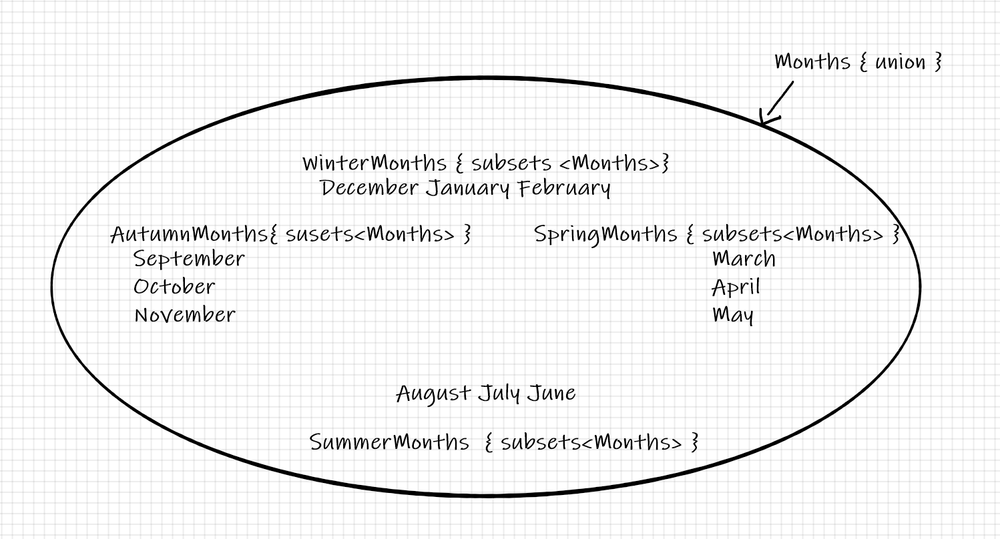

* {redefines \<Property-Name>} - redefines a property from the class. This property can only be used inside inherited class diagrams ( e.g. overriden properties in C# )
* {ordered} signals that the property is ordered
* {seq} or {sequence} signals that the property is a sequence of elements
* {unique} means that there ar eno elements repeating themselves
* {nonunique} is the oppposite of {unique}
* {composite} defines that the property is built out of more parts and it needs these parts in order to become a whole. The property is responsible for adding and deleting its own parts. This property, {composite} of properties if essentially used when working with composition relationships between class diagrams


Example of a class diagram with properties in code ( C# ):

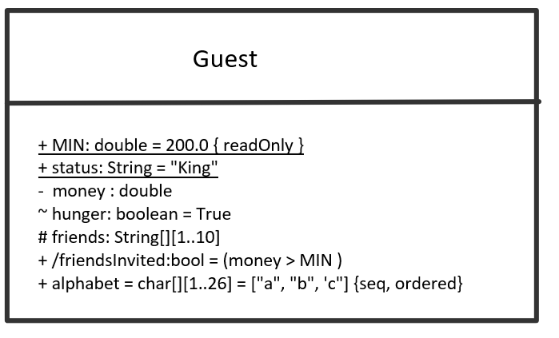

Code in C#:


#### Operations / Methods

Like properties, there are 2 types of methods:

* Instance Methods
* Class Methods ( underlined )

The UML structure for methods is :

**[Visibility]Name([Parameter-List])[:ReturnValueType][Multiplicity][{Property}]**

1. Visibility 
   - \+ = public
   - \- = private
   - \# = protected
   - ~ = package ( only visible for classes insied the same package )
<br/>
2. Name
    The name of the method. You can follow special styling guides for the programming language you're using
<br/>
3. [Parameter-List]
    This is a list of arguments that the method might need
    This is the structure of argument :

        [Passing-Style]Name:Type[Multiplicity][=DefaultValue][{Property}]
        
    - Passing Style
        * in - the argument can only be read inside the method, it's read-only
        * out - the argument can't be read, it can only be written by the method ( usually used as a return value )
        * inout - the argument can be rad and written by the method
    
    - Name
        The name of the argument
    
    - :Type
        The type of the argument
    
    - Multiplicity
        It describes the amount of elements that fit into that property. 
        Example:
        * [1] <> only one element
        * [1..2] <> one or two elements 
        * [1..*] <> at least one element must be present
        * [0..*] or [*]  no boundaries

    - = Default Value
        The default value of the property if it's not given
    
    - {Property}
        The property of the argument ( see properties of class diagram above )
<br/>    
4. ReturnValueType
    The type of the return value
<br/>
5. Multiplicity
    It describes the amount of elements that fit into that property. 
    Example:
    * [1] <> only one element
    * [1..2] <> one or two elements 
    * [1..*] <> at least one element must be present
    * [0..*] or [*]  no boundaries
<br/>
6. {Property}
    Special properties of the return value ( see properties of class diagram above )

#### Binary Association

A binary association represents two class diagrams that "know" about each other.

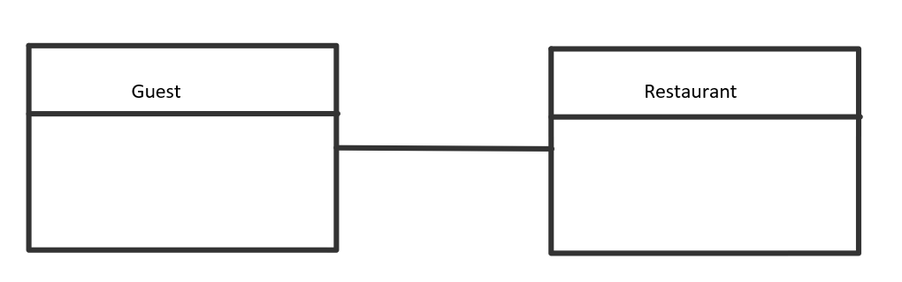

In this example, Guest can interact with Restaurant and vice-versa.

#### Association name and reading direction

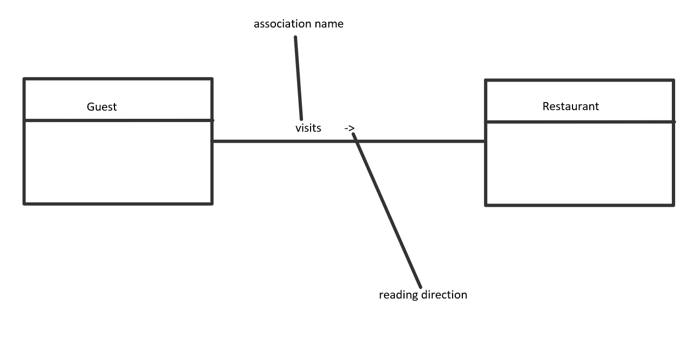

#### Multiplicity of associations

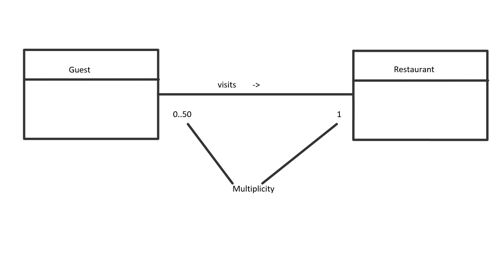

One Guest can visit only one restaurant.
One Restaurant can contain up to 50 Guests

#### Association Roles

You can use association roles in order to describe the role of a class in a relation/association with another class
Let's say that a smal compnay buys something from a big company and then sells it to you.

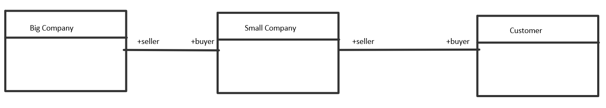

#### What is an association end ?

An association end is a connection between the line depicting an association and the icon depicting the connected classifier.

#### Association properties

* {subsets \<Association-End>} - shows that the association end subsets another classifier
* {union} - unifies all the association ends with {subsets}
* {redefines \<Association-End>} - redefines another association end
* {ordered} signals that the classifier must be ordered. Example:

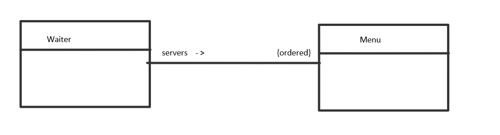

The menu has to be served by the waiter in an ordered manner ( not dessert first. )

* {nonunique} means that the association end can repeat itself
* {sequence} or {seq} means that the association ends points at a sequence of objects

These properties are strictly for association ends and they determine for example how the classifiers are built when we use properties like {seq} and {ordered}. The association ends in that case points at an ordered sequence.

#### Constraints:

An XOR constraint specifies that only one of the two associations can exist at the same time:

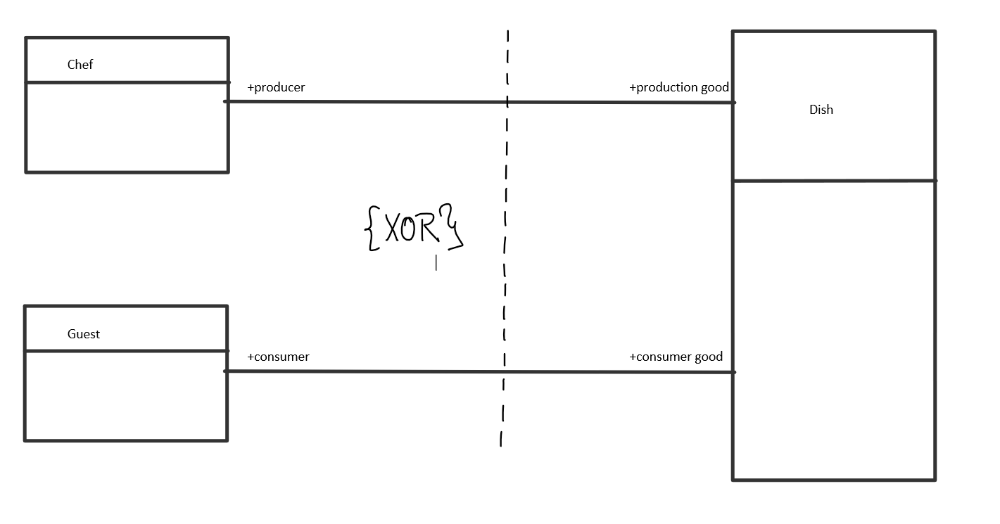

#### Association Navigation

There are 3 types of navigation:
    * navigable
    * not navigable
    * unspecified

#### Bidirectional Navigation

A bidirectional navigation allows both classes to know each other. They can both interact with each other

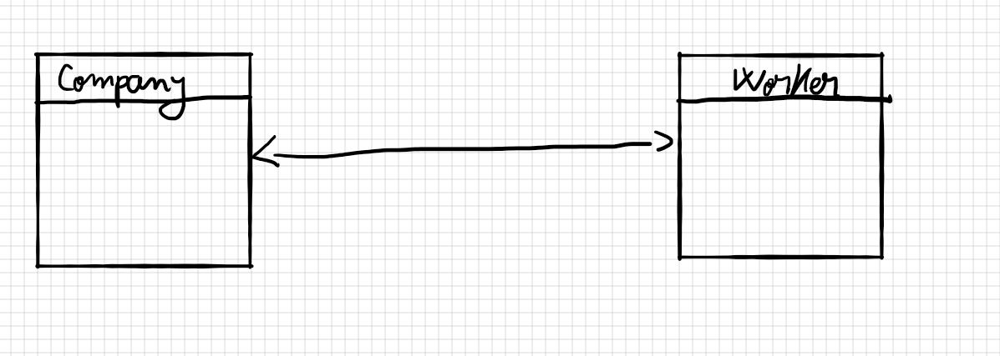

Example:

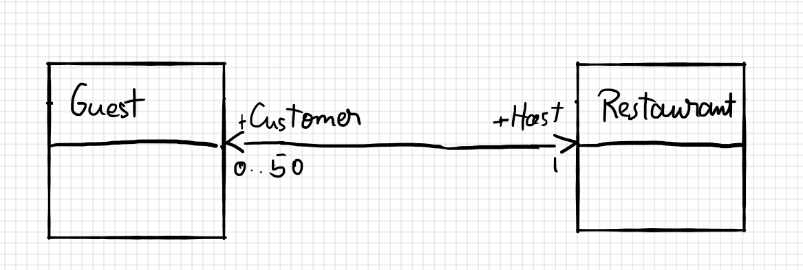

Code ( C# ):

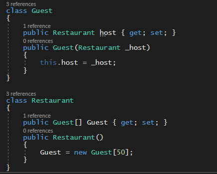


#### Prohibited Navigation

A prohibited navigation means that the classes don't know each other and aren't allowed to interact with each other

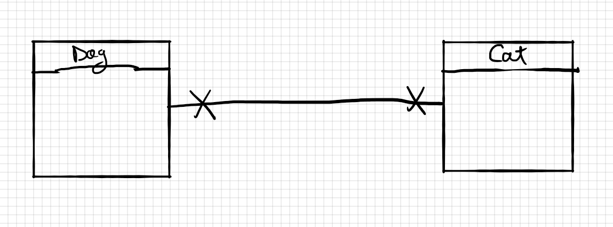

#### Unspecified Navigation

By using an unspecified navigation we avoid setting a strict prohibition or a force navigation between the elements. The navigation between the cases is allowed but not mendatory

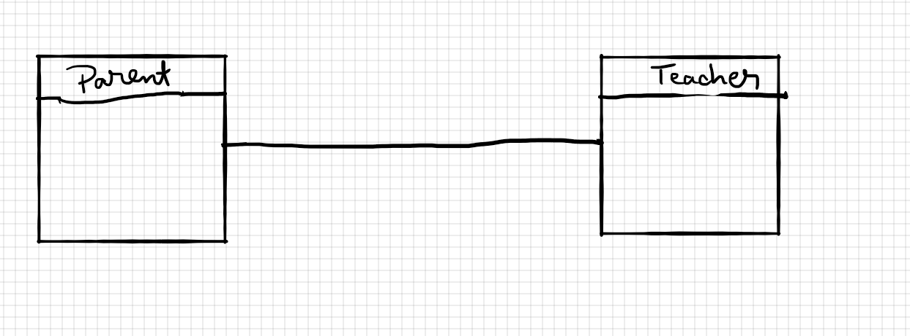

#### Unidirectional Navigation

A unidirectional navigation allows the navigation only on one side

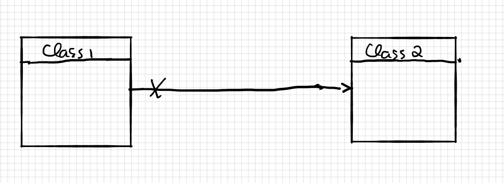

#### Partial Navigation

A partial navigation is only partially defined. On one side, the navigation is direct while on the other side it is not defined, the interaction between the classes on the undefined side is possible but not mendatory

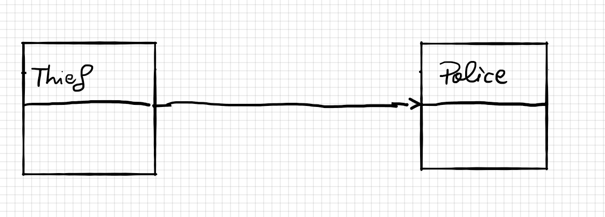

In this example the thief knows about the police and can interact with them. Police on the other side might or might not know about him and be able to interact with him.

#### Ownership

The ownership navigation sohws, as the name says, that a class owns anohter class. In this case the dish, which acts as a product is owned by the guest, which is a consumer

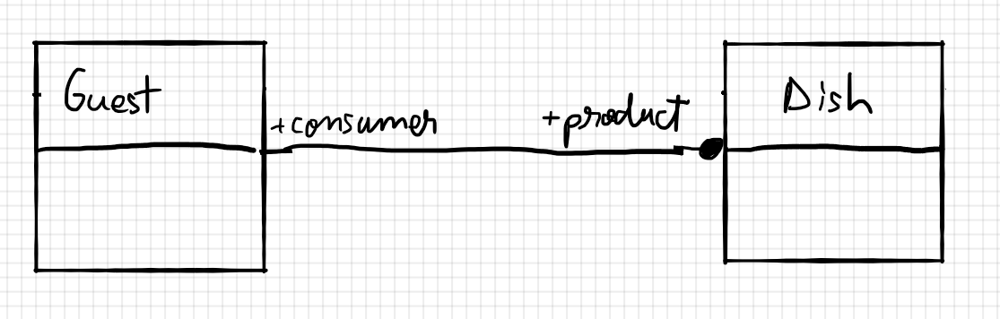

#### Reflexive Association

Reflexive associations are associations between classes and themselves, it's when a class has an instances of itself inside itself

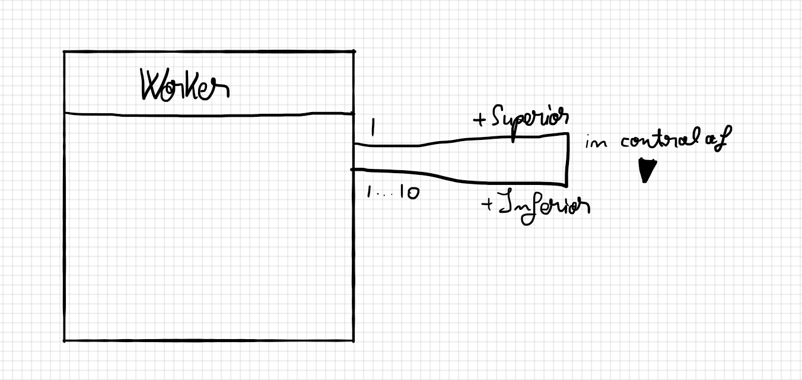

Code ( C# ):

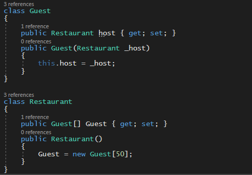

#### N-ary Association

An n-ary association is an association between multiple classes. Most programming language don't have a support for this type of association, so you'll have to build a special class instead of the n-ray association.

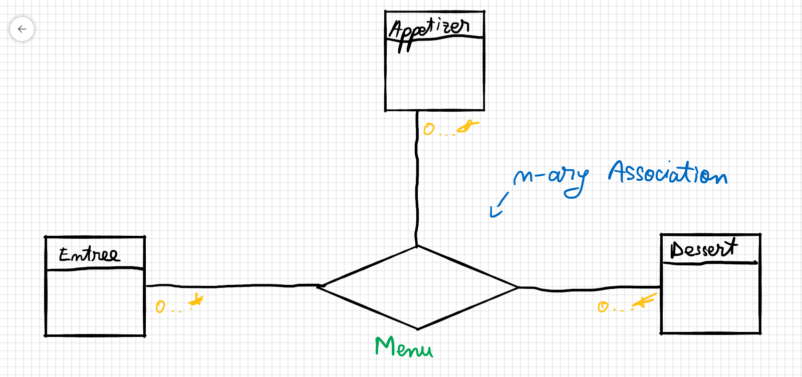

#### Qualified Association

A qualified association needs a qualifier that will be used on the first class in order to reference the second class. The qualifier will work like a foreign key does in databases.

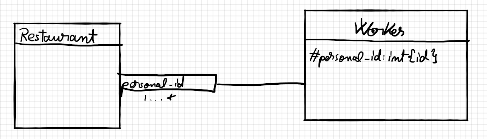

#### Association Class

In certain cases you might have some properties or methods that don't match the ideas of the classes that you've built, so you might want to build an association class because that's where they fit best. You might also want to be more specific about the association and make a class for it

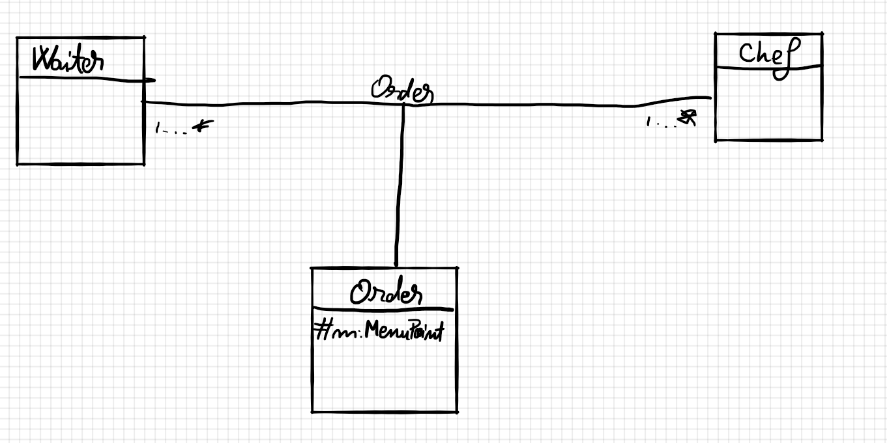

You don't have to name the association if you have the association class but if you do, they both must have the same name

In this case MenuPoint wouldn't have matched the ideas of the two classes, Waiter and Chef, so it was in our best interest to creat an association class.


#### Aggregation

The aggregation is a special form of binary association where you have one single Whole and more parts that together build the whole. In the case of aggregation, the whole can still exist if some parts are remove and vice-versa. The parts can exist individually without the whole.

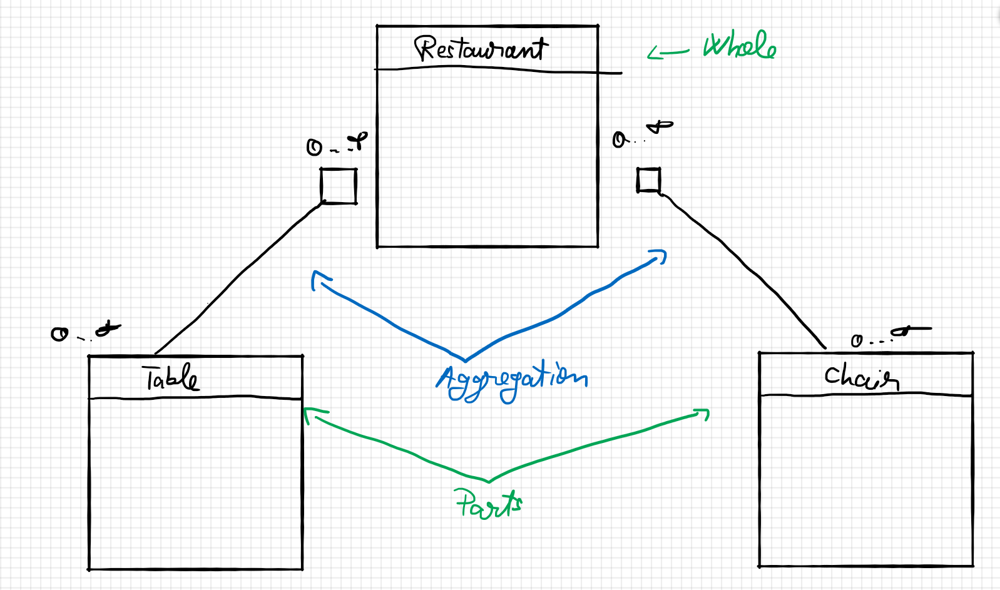

In this examle the restaurant which is the whole, has an aggergation built with table & chair. A restaurant is still a restaurant even without tables and chairs. A table and a chair can still eixst individually outside restaurants....

#### Composition

A composition is strong form of aggergation where the whole can't exist without all the parts.

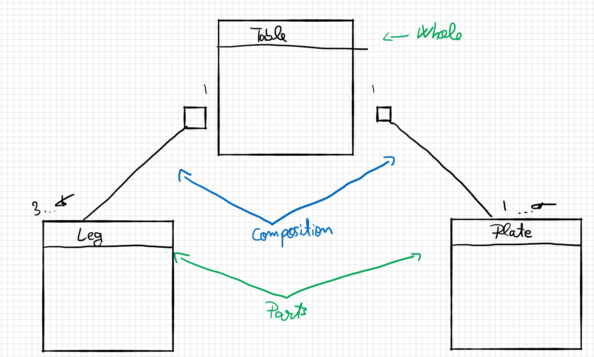

#### Dependency

A dependency is a Client-Supplier association and **servers for documentation purposes only**. It signals that a class needs another class for its specification or implementation.

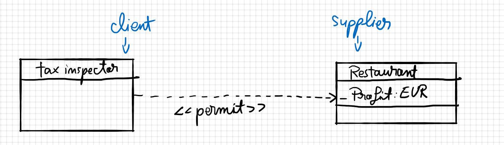

There are several types of dependencies:

* \<\<call>> = this type of dependency signifies that the client calls at least one operation/method from the supplier
* \<\<create>> = this dependency signifies that instances of the client generate instance of the supplier
* \<\<derive>> = the client can derive from the supplier
* \<\<instantiate>> = specifies that the client is an instance of the supplier and it is mostly used between classes and object diagrams
* \<\<permit>> = it grants the client access to all the properties and methods of the supplier. In our case the tax inspector will have access to the private property Profit of the Restaurant
* \<\<refine>> = this dependency signals a refined specification of a class that. This dependency can be used for example in hte implementation phase when you want to refine a class that has already been modelled from the design phase.
* \<\<substitute>> = the client can completely replace the supplier without the need of an inheritance relationship
* \<\<trace>> = this dependency signals that both classes represent the same concept in different models\<
* \<\<use>> = the existence of the supplier is needed by the client in order to function properly

#### Inheritance

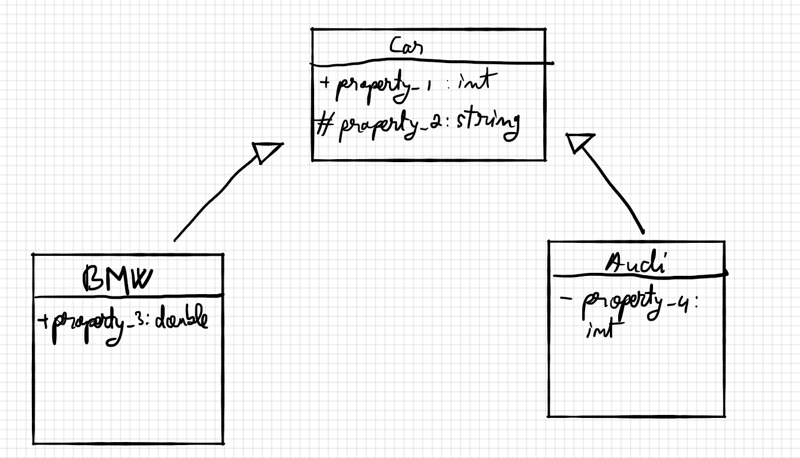

You can build inheritance groups and also name them.

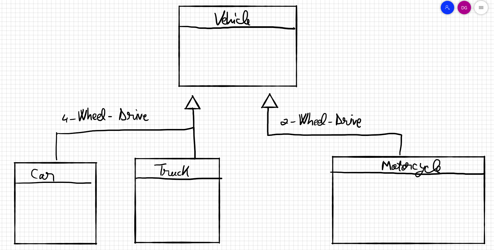

Inheritance groups also have properties:

* {complete, disjoint}

This property means that the group is complete. An instance cannot be classified as only the upper-class and it can't be classified as more than one class at the exact time

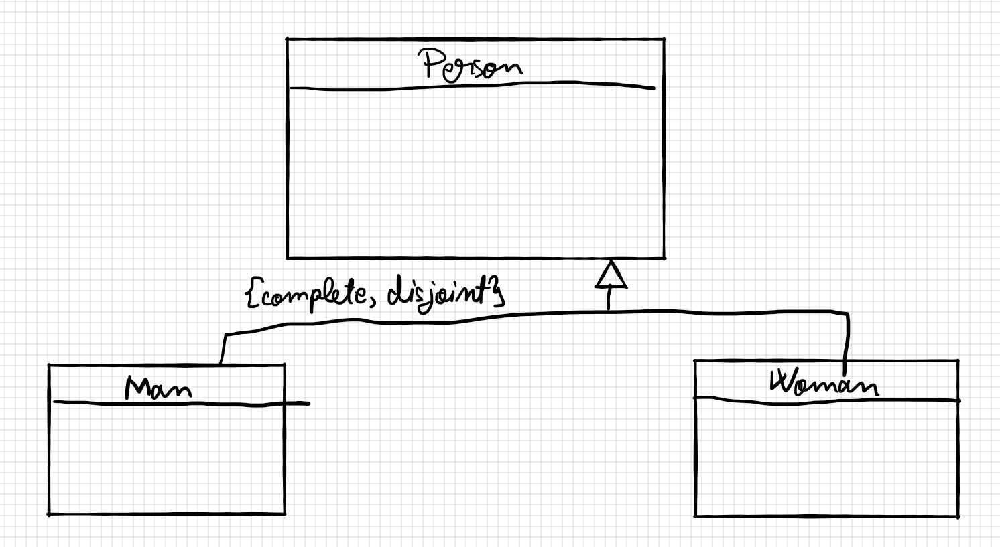
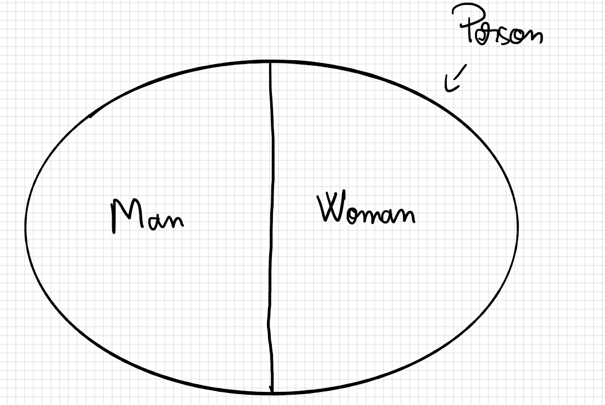

A person can only be a man or a woman. You can only have instance of the man or woman, not of the person. On top of that a person can't be a man and a female at the same time

* {incomplete, overlapping}

In this case, an instace can be member of the upper-class and/or any number of subclasses. The classification of "instance" is incomplete. Sometimes there are sub-classes involved, sometimes not.

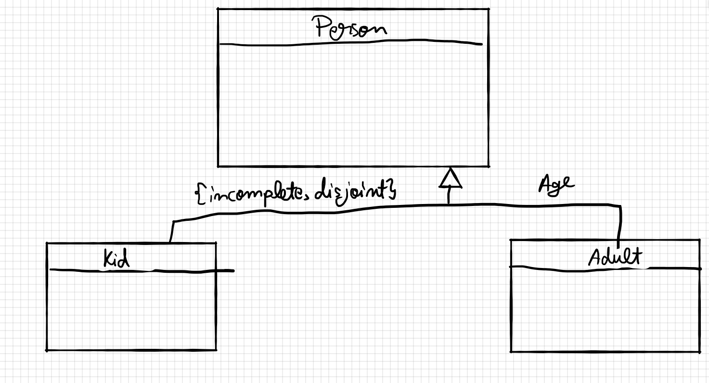
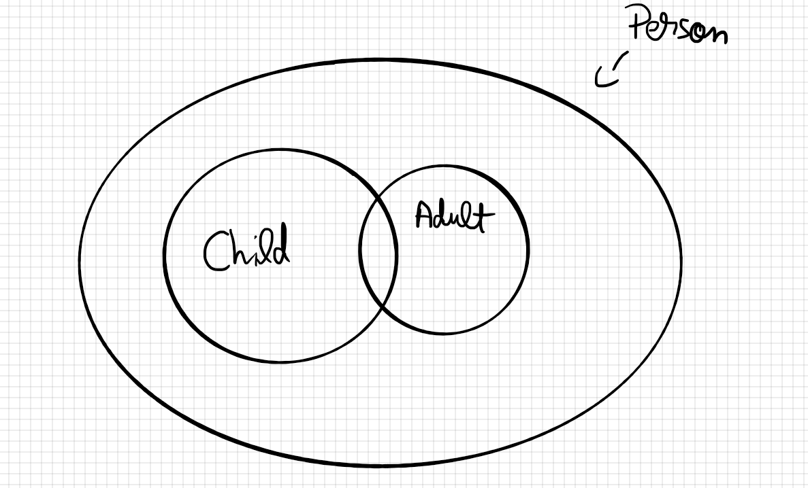

We could also have a teenage or youngadult class, which makes the group incomplete. On top of that you can have an instance that is both a Person & a kid or a person & adult or a person alone or a kid & adult which would make the person a teenager.

* {incomplete, disjoint} **DEFAULT if not given**
The group is not complete and the sub classes can't share instances

* {compete, overlapping}
The group is complete and the sub classes can share instances

#### Stereotypes

Stereotypes can be used in all diagram types in UML. They don't change the meaning of the diagram, thye just give information about the purpose and role of that model. Example:

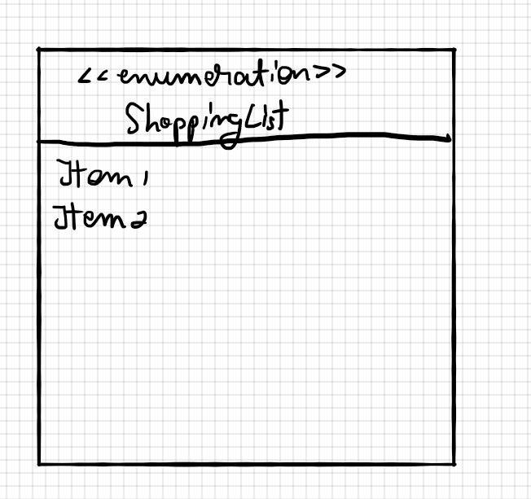

Here are the most important stereotypes:

* \<\<auxiliary>> = the aim of the class is to help other classes in the program. They are usually used together with \<\<focus>>
* \<\<focus>> = these classes build the logic of the program and they are helped by classes with the \<\<auxiliary>> stereotype
* \<\<interface>> = defines an interface
* \<\<utility>> = you can't build instance out of this class. It just serves as a toolbox for other classes. Example:

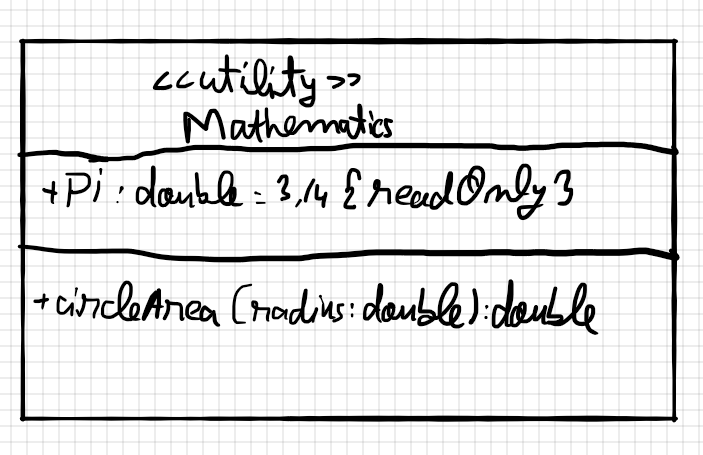

* \<\<dataType>> = you can define new data types that are unknown to uml
* \<\<enumeration>> or \<\<enum>> = defines an enum

You can also build your own stereotypes:

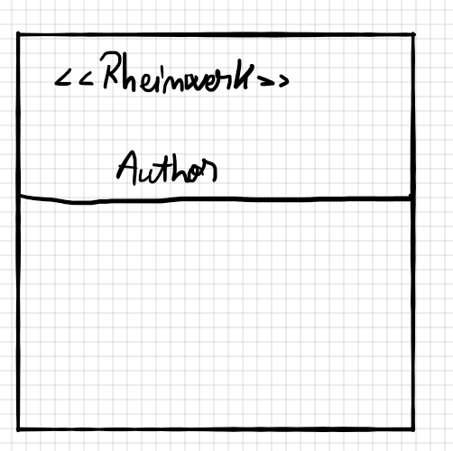

#### Abstract Class

In order to build an abstract class you have to add {abstract} below its name inside the class diagram. An abstract class deifnes the future blueprint for a class:

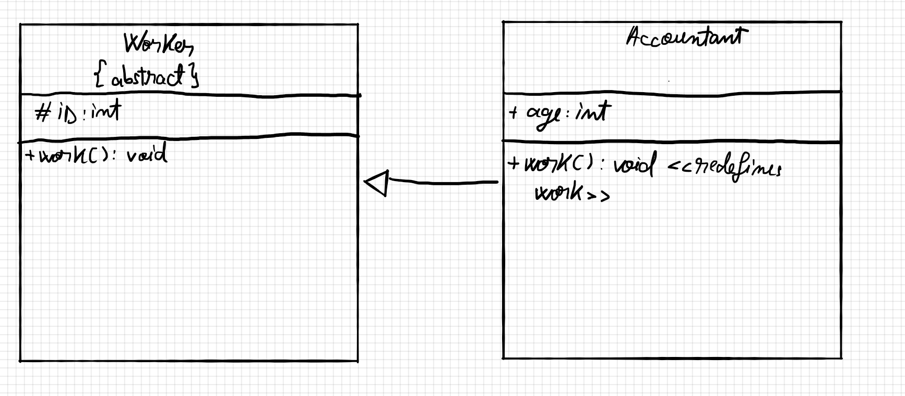

#### Template

Templates are built exactly like in C# ( generics )

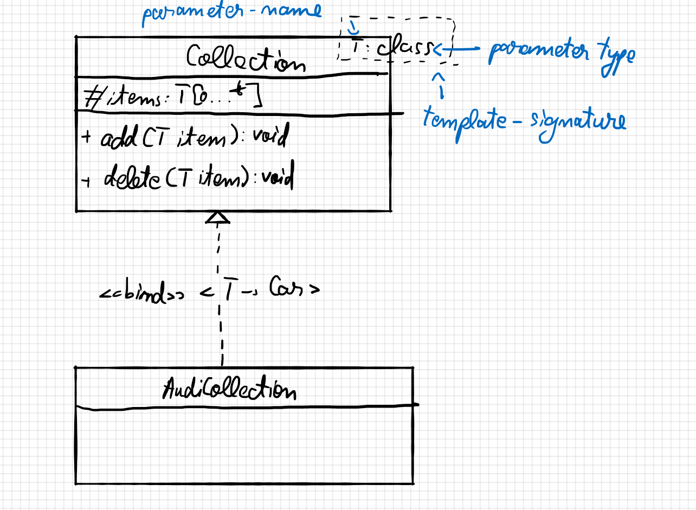

In order to build osmething out of a collection you must use bind:

**\<\<bind>>\<Template-Parameter-Name -> first_parameter, ..>**

Code example:

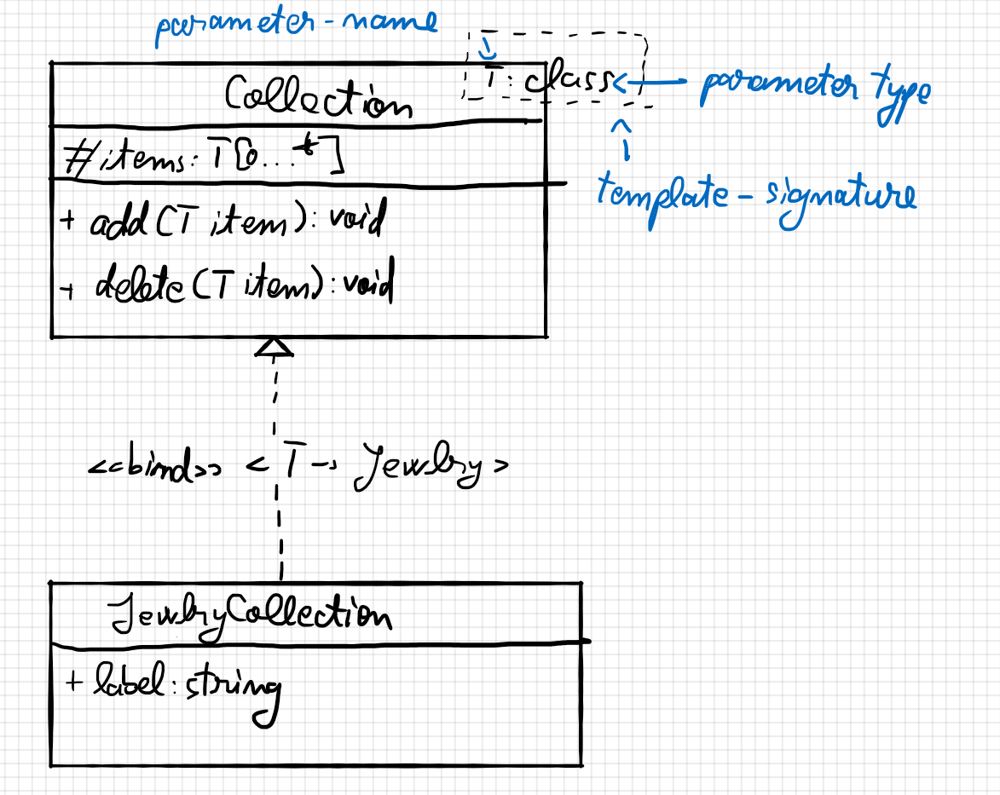

Code C# :

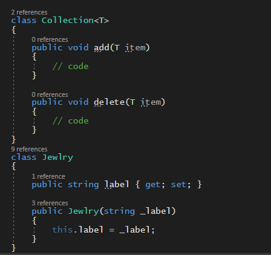

#### Interfaces

In order to build an interface you must use the \<\<inteface>> stereotype:

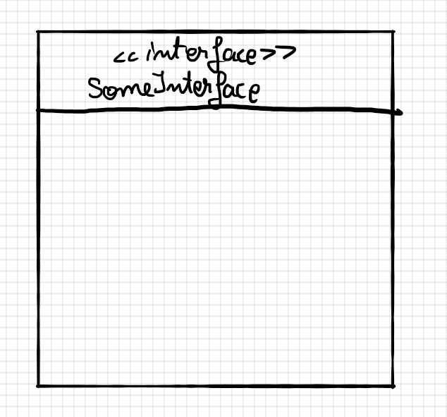

You can use interface in 2 ways:

* realized interfaces
* required interfaces

Realized interfaces are working as upper classes:

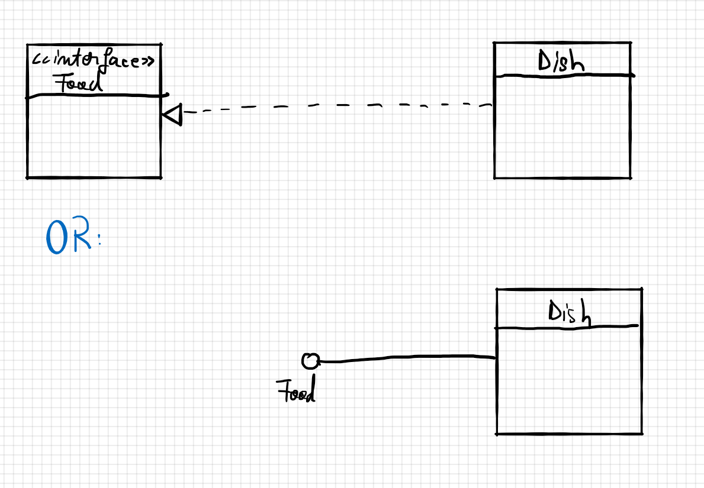

C# code:

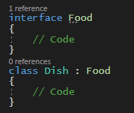

Required interfaces don't server as upper-classes but they are needed for classes to work

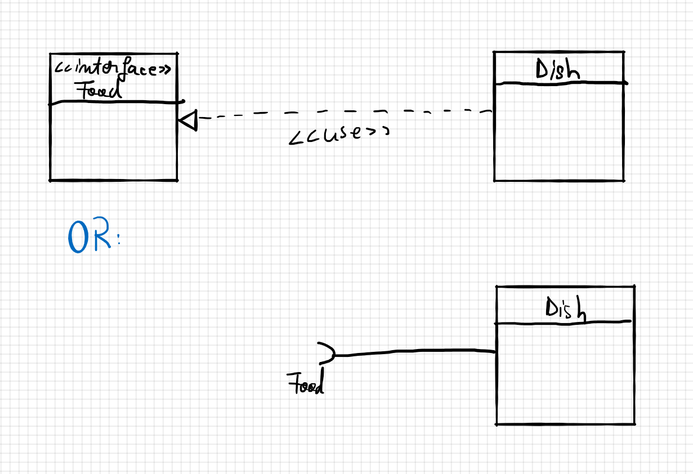

Java code:

```Java
interface Food{}
class Dish {
    public Food dish_food;G$
}
```

You can also mix the types of interfaces that you use:

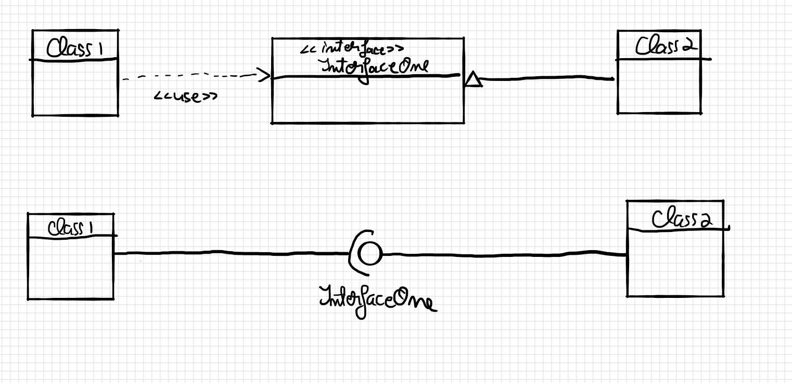

# 3. Objektdiagramm / Object diagram

Class diagrams are used to build the blueprint for objects. We use object diagrams to represent those objects. We can use the dependency \<instantiate> between a class diagram and an object diagram to show where the object diagram came from. Object diagrams are used in different stages of the program to represent an objects state. If no object diagrams have been built based on a class diagram, then it's probably a good idea to delete the class diagram. Object diagrams also help verify the correctitude of class diagrams.

Example for object diagram:

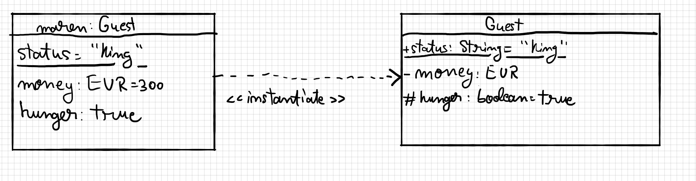

Object diagrams, just like class diagrams, can build connections with each other. However, in this case, they are not called "associations" anymore, we call them ***links***. If two class diagrams build an association between each other, then a link between their object diagrams must be built as well. This is not a rule but if two classes are associated with each other, then it's only logical that the object diagrams should too. If this is not the case then maybe we should change something inside the class diagram. Maybe the association between the classes is not correct. Links have everything that associations have ( association name, roles, reading direction, etc. ). The only thing different is the multiplicity, since one object tcan only link to one single object. If you want to link one object to 3 more objects, then you can build more links. Here is an example of an object diagram with links:

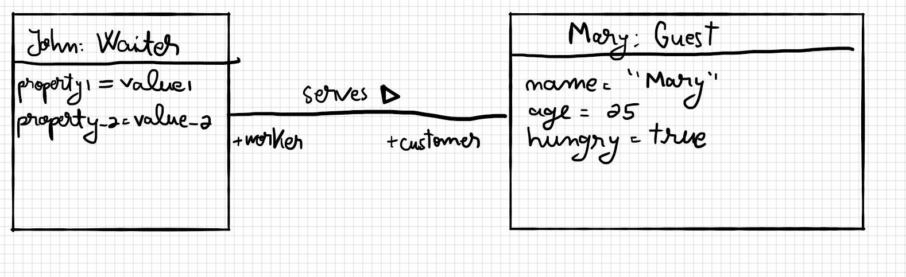

# 4. Kompositionsstrukturdiagramm  / Composite structure diagram

### 1. Part

Composite structure diagrams show how components work together inside a class. They show the internal structure of a class. They are also called architecture diagrams.

A Part is used to model a subset of components that might be contained inside a class.
Example:

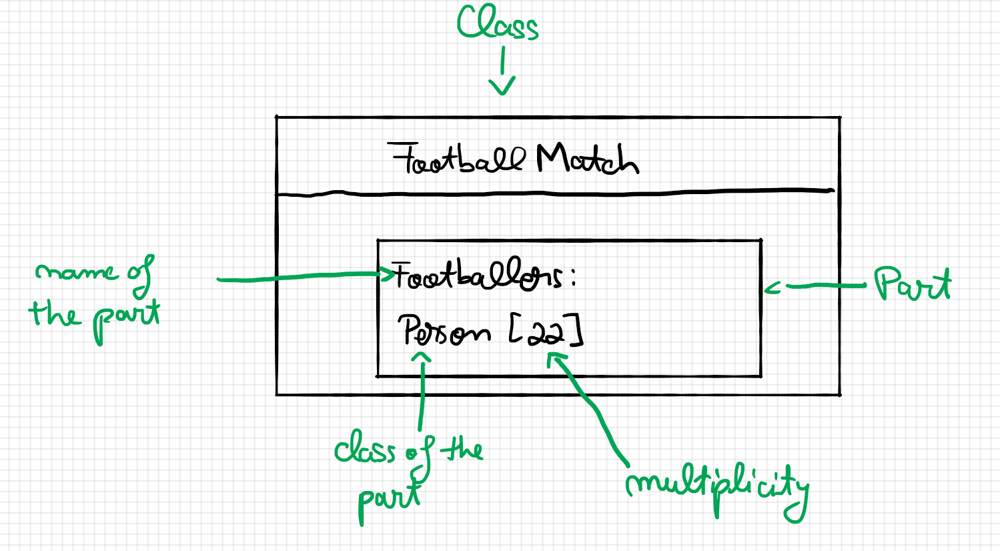

Even if a football match technically needs more people in order to function, the part ```Footballers``` represents only a small subset of all the objects of the class ```Person``` inside the class ```FootballMatch```.
If a part has no relationship with other parts then it is build with a dashed line around itself.

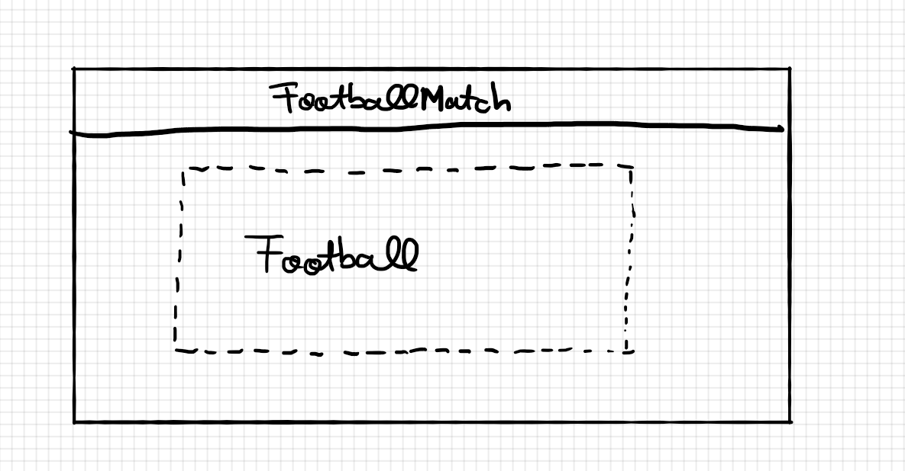

The following example using a class diagram with composition might make the use cases of parts clearer:

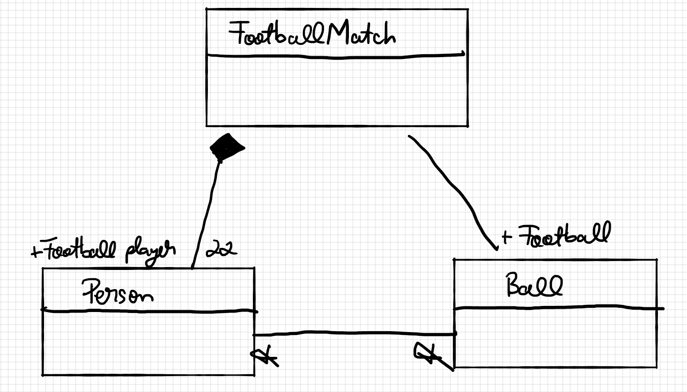

In this class diagram you can see the broad class structure and you can see that a ```FootballMatch``` needs 22 object of the class ```Person``` and it might also interact with a ```Ball```, but you don't know exactly how the classes ```Person``` and ```Ball``` interact with each other internally. This is what we are using the composite structure diagram for. It reveals how the internal components of a class interact with each other and helps us visualize those actions much better than a class diagram can do. Here is the composite structure diagram for the ```FootballMatch``` that shows how the classes ```Person``` and ```Ball``` interact with each other, interally:

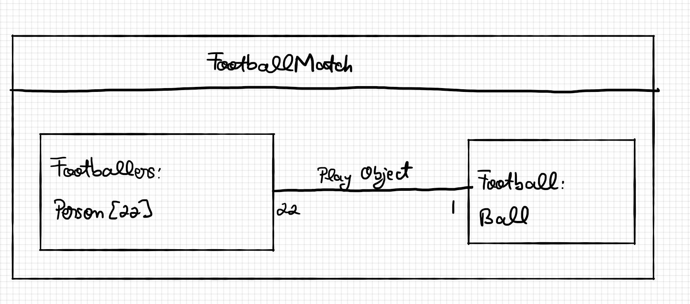

Parts are used to desribe the internal use of classes and help you visualize a model for a specific context that you wouldn't otherwise be able to, outside of a composite structure diagram.

### 2. Port and connector

A port describes an interaction point between parts, interfaces, classes, and so on inside a composite structure diagram. Connectors connect parts and ports.

Here is an example:

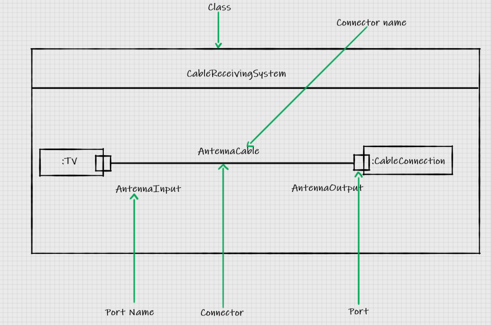

In this example the TV and the CableConnection are the parts. We have a connector that connects two ports with each other. One port is the port AntennaInput, that comes from the TV part and the other port is the AntennaOutput port that comes from the CableConnection part.

Connectors don't have to always connects components of the same type ( port, part, interface, etc. ), they can also connect a port and a part together, for example:

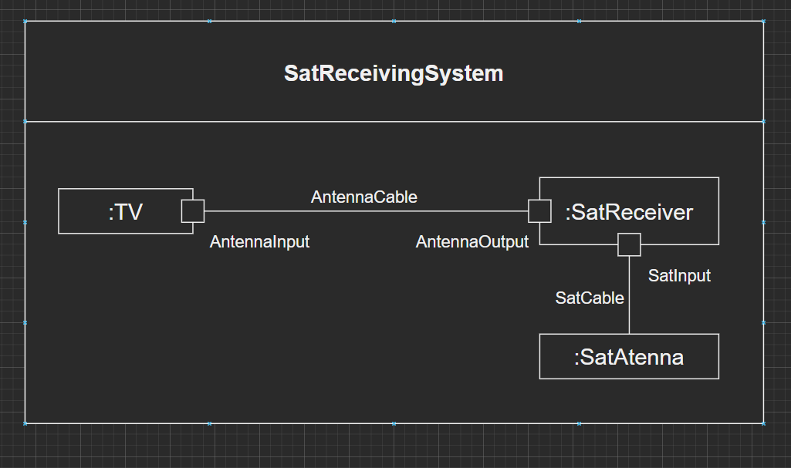

In this example, the connector with the name SatCable connects the SatInput port from the SatReceiver part with the SatAntenna part.
That means that the SatCable connects directly to the SatAntenna, it doesn't need a port like the SatReceiver needs the port SatInput.

Interfaces can also be used in composite structure diagrams. Interfaces can be of two types in this type of diagram:

* Realized interfaces : these interfaces work basically as upper-classes. They are needed for the implementation and they are drawn with a ball-symbol.
* Required interfaces : these interfaces aren't used as upper-classes, they are still needed for the implementation but the component that uses this interface, doesn't need to inherit from it. This type of interfaces are drawn using a socket-symbol.

Here is an example:

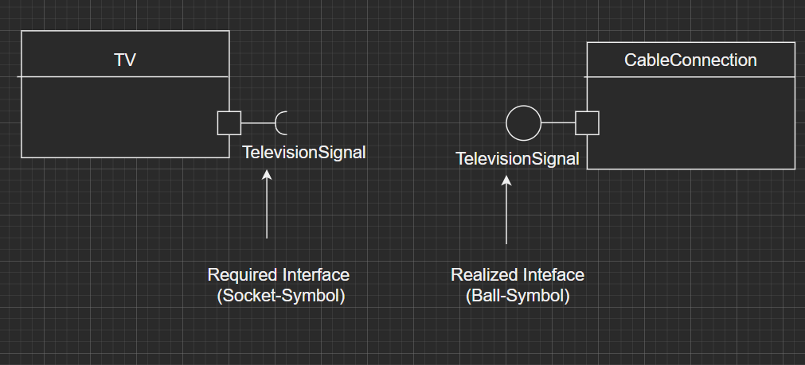

It is also possible to define muliple interfaces to one single port. When multiple interfaces are assigned to a port, that port now has become a **complex port**.

Example:

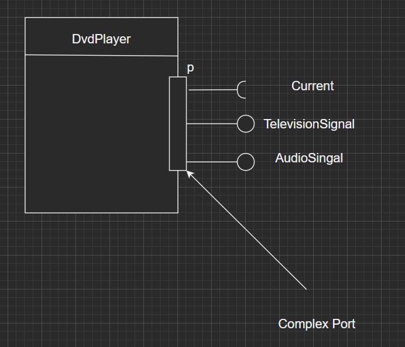

A behavior port is a port that connects certain components ( part, ports, interfaces, etc. ) to a certain state of the classifier it belongs to ( the 'classifier' is the 'class' that it belongs to )

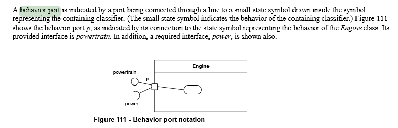

In this example the port with the name 'p' interacts with 2 interfaces ( powertrain and power ). The port is a behavior port since the interfaces that the port interacts with are in direct connection with a certain state of the engine ( for brevary that state could be on/off ).

Here is the UML diagram for an example containing a behavior port:

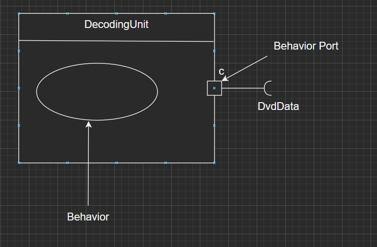

Here is an example of a composite structure diagram in C#:

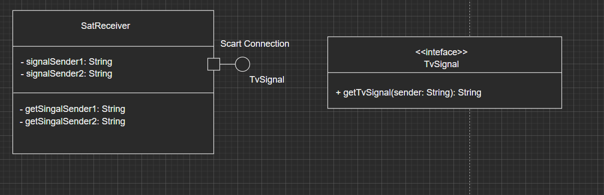

```CSharp
public class Program
{
    static void Main(string[] args)
    {
        SatReceiver sat = new SatReceiver();

        Console.WriteLine(sat.scartConnection.GetTvSignal("sender1"));
        Console.WriteLine(sat.scartConnection.GetTvSignal("sender2"));
        Console.WriteLine(sat.scartConnection.GetTvSignal("sender3"));
    }
}
public interface TvSignal
{
    string GetTvSignal(string sender);
}
public class SatReceiver
{
    private string signalSender1;
    private string signalSender2;
    private string GetSignalSender1() => signalSender1;
    private string GetSignalSender2() => signalSender2;

    public class ScartConnection : TvSignal
    {
        private readonly SatReceiver satReceiver;

        public ScartConnection(SatReceiver satReceiver) => this.satReceiver = satReceiver;

        public String GetTvSignal(string sender)
        {
            switch (sender)
            {
                case "sender1":
                    return this.satReceiver.GetSignalSender1();
                case "sender2":
                    return this.satReceiver.GetSignalSender2();
                default:
                    return "Error";
            }
        }
    }

    public ScartConnection scartConnection { get; private set; }
    public SatReceiver()
    {
        signalSender1 = "Tv signal from sender 1";
        signalSender2 = "Tv signal from sender 2";
        scartConnection = new ScartConnection(this);
    }
}
```

### 3. Collaboration

Collaborations describe the structure of objects, that work together to accomplish a certain task inside the classifier. These objects play a **role** in the collaboration that helps accomplish that task. The roles can be connected through normal connections, that we've already learned.

The idea behind a collaboration is to see what are the elements that work together internally, inside a classifier, in order to accomplish a certain task.

Here is an example:

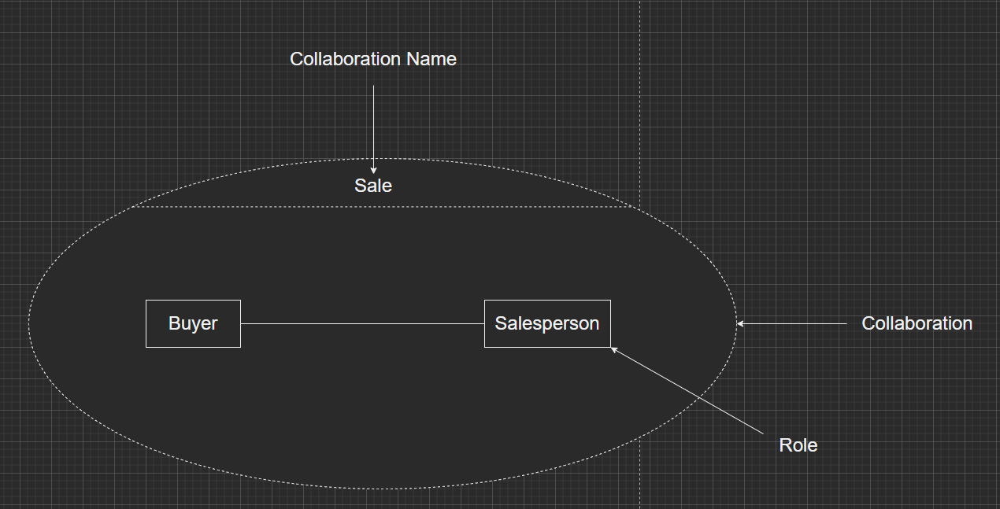

Inside the collaboration **Sale**, you need two objects that takes the roles of **buyer** and **salesperson**. The connection specifies that the two objects must communicate so that a **sale** can take place.

If certain roles need certain properties/method in order to play the role of the collaboration tha take take part of, you can describe that situation like this:

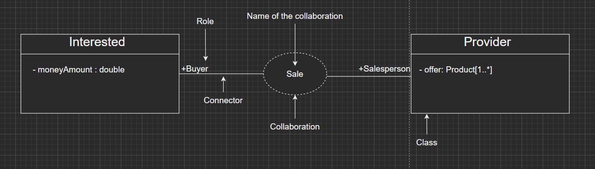

In this case, we need an object that contains the property ```moneyAmount``` in order for that object to act as the role of a **buyer**. We also need an object that contains the property ```offer``` in order for that object to complete the role of a **salesperson**.

### 4. Collaboration Application

With a collaboration application, you can take the use of an already existing collaboration and use that in a specific situation. 
You can think about a collaboration application as an instance of a collaboration. 

Here is an example:

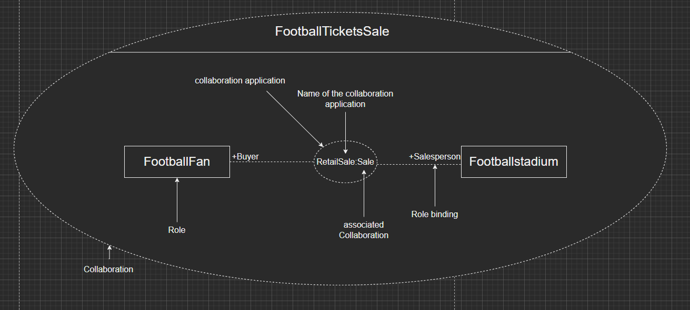

In the example before this one we've had the collaboration ```Sale```. Now, this collaboration application with the name **FootballTicketsSale**, implements the collaboration that we've already seen, that being **Sale**. You can see that the roles **Buyer** and **Salesperson** haven't changed, since they are not allowed to.

There is also an alternative notation for the collaboration application:

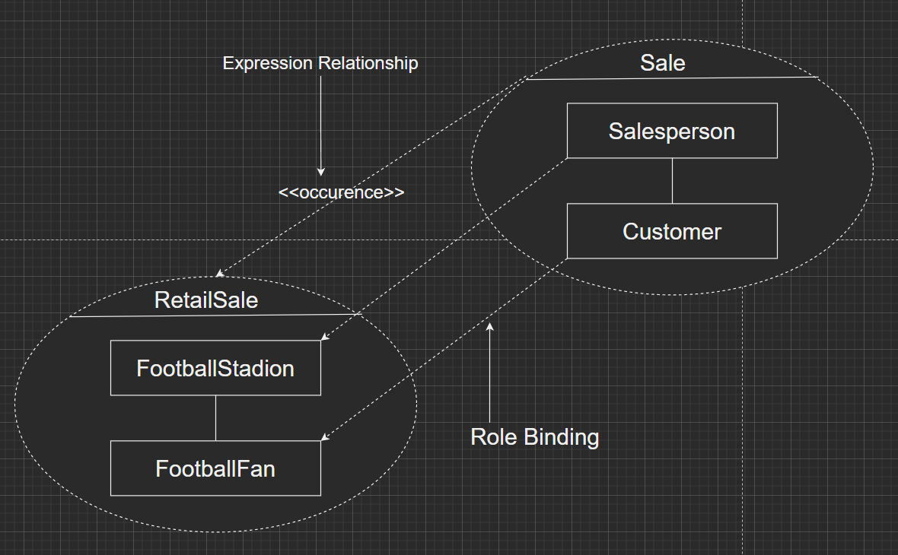

You can have more collaborations in an collaboration application, you aren't restricted to only rely on one single collaboration.

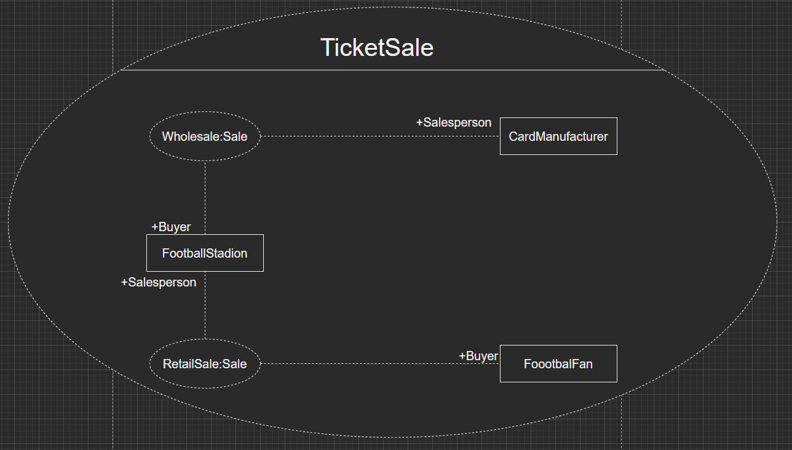

# 5. Komponentendiagramm / Component Diagram

### Components

Component diagrams are widely used in software architecture. They are usually used in parallel with Deployment Diagrams.

Here is what a component looks like and how it interacts with the outside assemblies:


A component represents an element of a system. Its behavior can be represented by the realized and required interfaces that it works with. Interfaces can be bound to ports, just like a Composite structure diagram ( Chapter 4 ). 

There are alternative ways of notation elements for interfaces. You can also use inheritence and ```<<use>>``` dependency for interfaces, which is a lot more verbose:

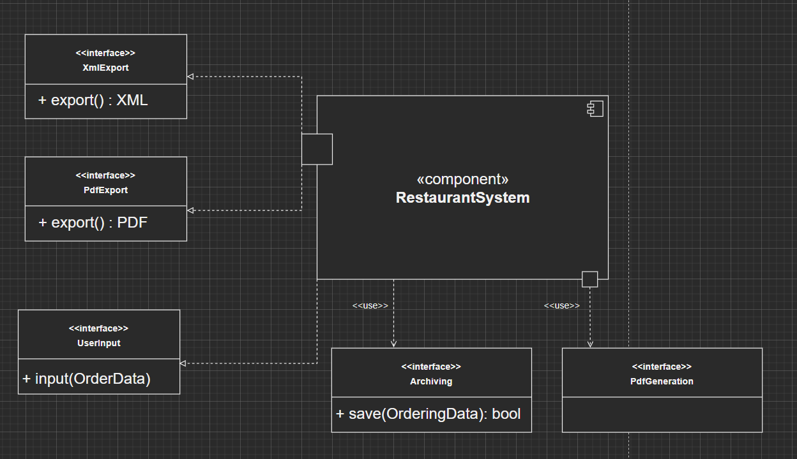

There are also other ways of representing interfaces that are bound to your components. Another way of doing it is the **Black-Box-Vision**:

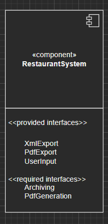

Components can also contain other components themselves. They usually have the ```<<subsystem>>``` stereotype. Here are all stereotypes that a component can have and their meaning:

* ```<<implement>>```. This type of component doesn't contain any personal specification. It repreesnts the implementation of other components that have the ```<<specification>>``` stereotype.
* ```<<specification>>```. These components represent a provided interface. They realization is done by ```<<implement>>``` components.
* ```<<entity>>``` This represents components that contain persistent information, something like a database for example.
* ```<<process>>```. A processed component is a transaction-based component that works with the ACID-principle:
    * Atomic: The components either complete their actions or they don't. If a runtime error occurs, all the changes that have made up to that point will be reversed
    * Consistent: All the data is in a consistent state before and after the actions have started
    * Isolated: Every action will be executed in isolation. That means that it is invisible to other transactions.
    * Durability: Every change made to files will be permanently saved
* ```<<service>>```. The ```<<service>>``` components are stateless, functional components that provide services for other components
* ```<<subsystem>>```. A component that uses the ```<<subsystem>>``` stereotype is used usually used to decompose bigger systems. They represent a small portion of bigger systems.
* ```<<buildComponent>>```. These are components that are not a part of the development system but they are needed in order to build it. These can be IDEs, Compilers or VCS.

You can also expand the black box vision and design everything that there is to a component in one single box. This is called the **White box vision**:


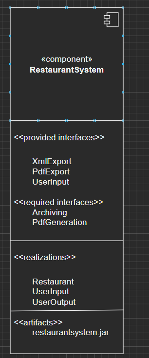


### Connector

There are 2 types of connectors when it comes to component diagrams:

* Assembly Connector
* Delegation Connector

An **Assembly Connector** represents the connection between two components and specifies that a component needs services from another component.

Assembly connectors are, as you've already seen, used with the ball-and-socket symbol. 

A **Delegation Connetor** represents a connection between an external interface or port and an internal component of another component.

Here is an example of assembly- and delegation connectors:

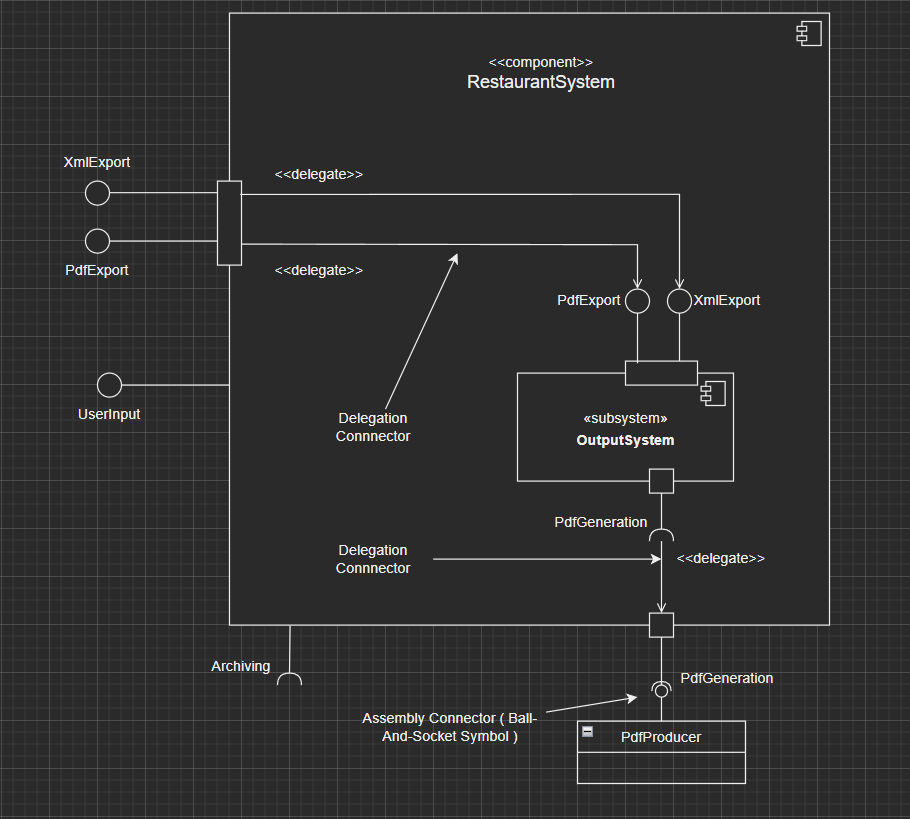

### Artifcats

An artifact is a physical information entity that is needed or built in the development process.

These can be:

* Files with source code
* ```.exe``` files
* Databases
* Tables of databases
* written documentation
* UML-Models
* E-Mails
* etc.

Here is an exmaple of how an artifact looks like:

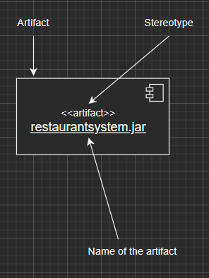

An artifact can have different types of stereotypes:

* ```<<script>>```. This is a script file ( e.g. javascript or php-file)
* ```<<source>>```. A ```<<source>>``` file contains source code and can be compiled by  an ```<<executable>>``` file
* ```<<executable>>```. This stereotype represents an executable file. On the Windows OS this would be an ```.exe``` file, on Linux it would be a ```.bin``` file.
* ```<<document>>```. This artifact represents a document that is neither ```<<source>>``` nor ```<<executable>>```. This artifact is usually a document that can't be assigned to other stereotypes.
* ```<<file>>```. This is a general file
* ```<<library>>```. This represents a library of code ( this could contain classes, functions, etc. ).

Artifact can also contain other internal artifacts.
In order to show that an artifact is used by a component you can add the stereotype ```<<manifest>>``` to the Manifest-Connection.

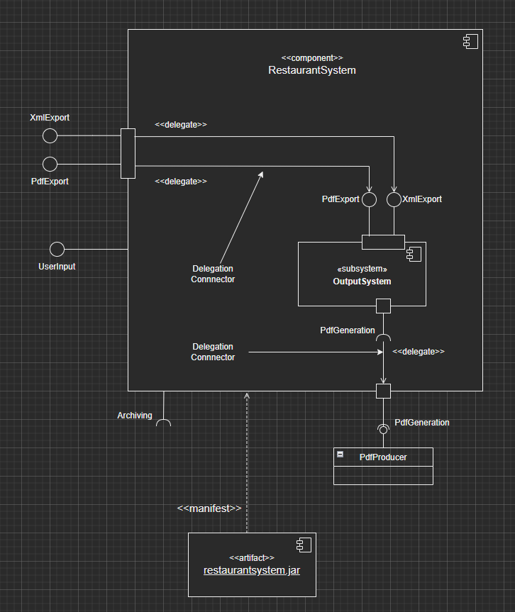

If you want to describe the manifest-connection in more detail you can use the following stereotypes:

* ```<<tool-generated>>```. The artifact was generated by a tool. There are a lot of tools, for example, that can generate artifacts directly from UML Diagrams.
* ```<<custom code>>```. The artifact was custom written by a user.


# 6. Verteilungsdiagramm / Deployment Diagram

### Applications of the diagram

A deployment diagram is used to specify hardware and software environments and the connections between each component. Deployment diagrams are usually used in combination with component diagrams. They are usually used in the design phase.

By using deployment diagrams you can build the architecture of the software and prepare and test the hardware and software environments.

### Notation elements.

### Nodes

**A node represents a system resource.**

A node contains the name of the object and its class ( the name is optional, but the class not ).

Example:

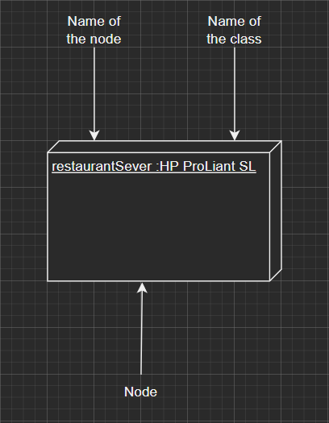

### Nodes stereotypes

Nodes can use stereotypes in order to thoroughly describe their functionality:

* ```<<device>>``` - A ```<<device>>``` node represents a physical component ( hardware ).

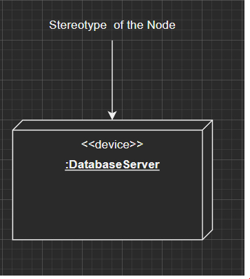

* ```<<exeuction environment>>``` - This type of node represents an execution environment. That can be for example a tomcat server for java applets or even an entire OS.

* ```<<application server>>``` - This is a node that provides an application for another node of type ```<<client workstation>>``` and mostly contains one or more nodes of type ```<<execution environment>>```. 

* ```<<client workstation>>``` - This node takes the services of an application provided by a node of the ```<<application server>>``` type. Nodes of type ```<<client workstation>>``` and ```<<application server>>``` are usually modeled together.

* ```<<mobile device>>``` - These are mobile devices like Notebooks or phones for example.

* ```<<embedded device>>``` - There are devices that are embedded in other devices.

### Node properties and methods

**Nodes can contain attributes/properties and methods:**

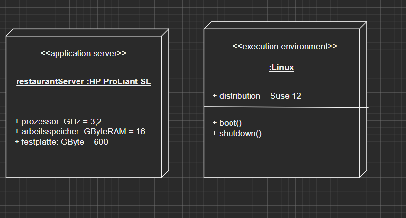

### Internal nodes and artifacts

**Nodes can also contain other nodes or artifacts inside of them:**

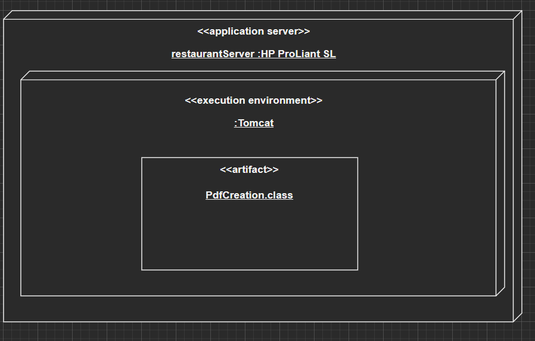

In the example above we have an application server HP ProLiant SL that contains the execution environment Tomcat and that execution environment has an artifact called *PdfCreation.class*.

### Deployment Dependency

In order to show that an artifact is getting deployed inside an execution environment, you must use the *deploy*-dependency:

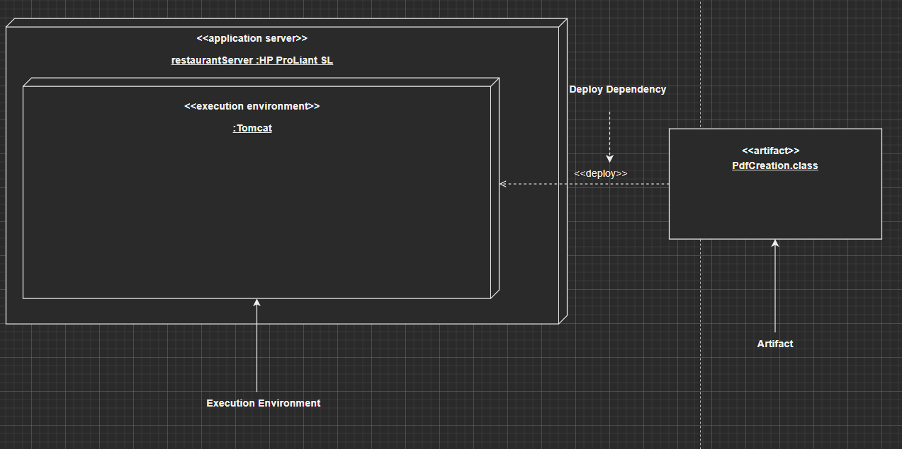

### Deployment Specification

You can also give more information to the dependency between two nodes.

A **Deployment Specification** defines execution parameters of an artifact in a node. It is usually placed on the deployment dependency with the execution parameters as their attributes/properties. *The execution parameters can also be placed directly inside of the artifact, if needed*.

Example:

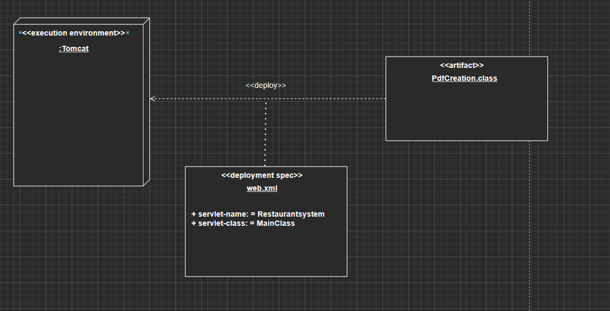

### Communication Path

A *communication path* describes an association between two notes. The associations are the same as the associations in a normal class diagram ( it can contain a name, reading direction, multiplicity, roles, it can be of different types, etc. ).

Example:

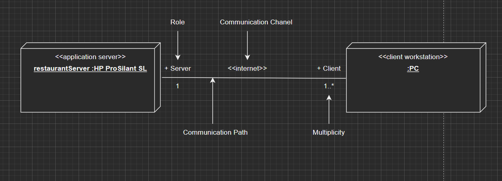


# 7. Paketdiagram / Package Diagram

## Use Cases

Package diagrams are used in the early phases of software development (like analysis or design ) in order to structure the model vertically as well as horizontally.

Through horizontal structuring we mean the opportunity to bundle UML elements that work together in packages.

Packages can have sub-packages and that is the vertical structuring. The packages on the top can contain the whole project while the sub-packages at the bottom can describe the details of the project.

With the help of vertical structuring we can build certain levels of abstraction of a model and we also have the possibility to zoom into the details if needed.

You should structure your model horizontally and vertically in order to build a certain case of abstraction and make it easier to use and understand.

## Notation elements

### Package

#### Description

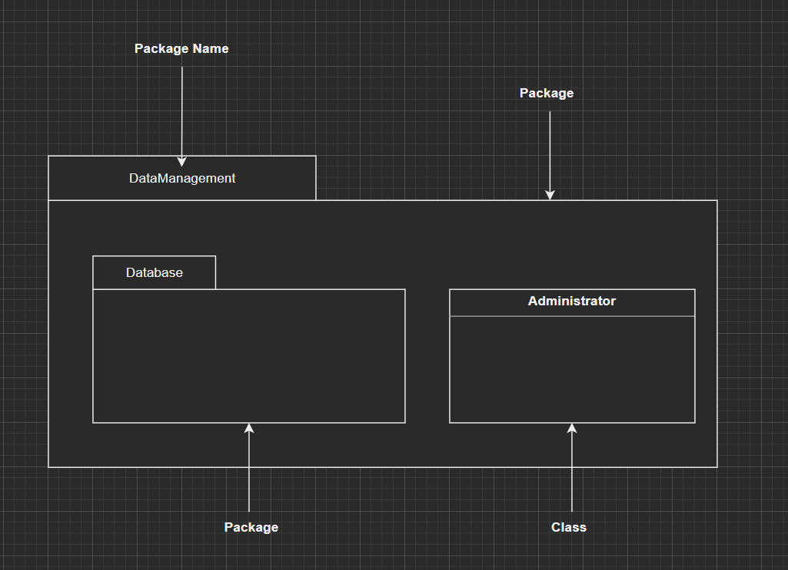

Package diagrams group elements together and namespaces that pack these elements together.
In the package diagram above you can see the pacakge ```DataManagement``` that contains the class ```Administrator``` and another sub-package ```Database```.

There is also another notation for package diagrams:

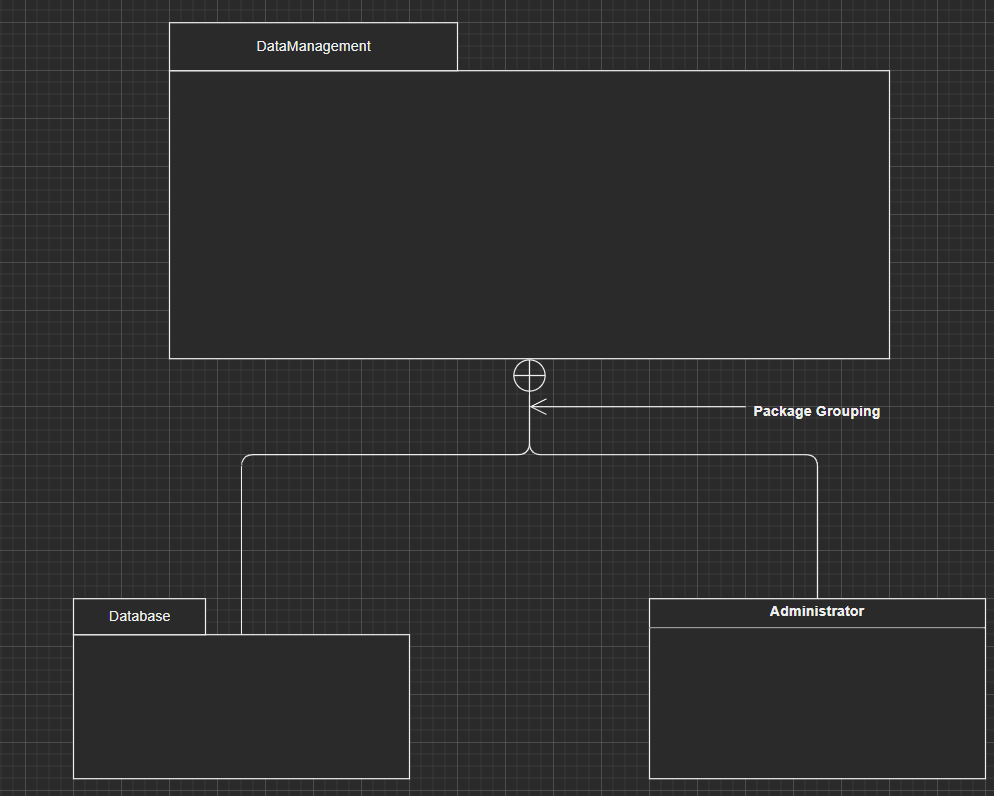

The above diagrams are semantically the same.

All the elements inside a package **must** have different names. Although, elements that are in different packages can have names that are the same.

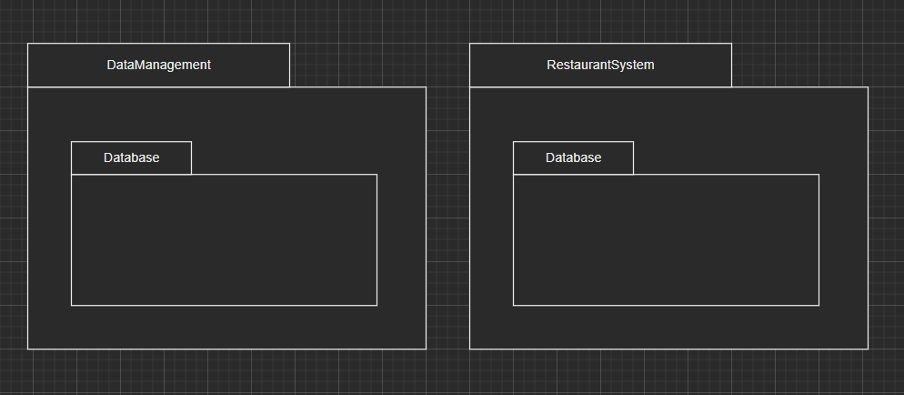


The sub-packages with the same name in these 2 different packages can't however be identified using theyr ***unqualified name*** ( ```Database``` ) since they can't be differentiated. In this case you have to use their ***qualified name*** which means adding the name of their package followed by 2 colons and the name of the sub-package: ***```DataManagement::Database```*** and ***```RestaurantSystem::Database```***.

The elements from a package are not separable from the package. If you delete a package, you delete all the elements inside of it automatically.

Even if you can't see any elements inside a package that doesn't mean that it's empty. UML allows you to hide certain arbitrary sub-packages in order to make the diagram clear.

All the elements of a package are visible to one another. Just like in class diagrams, the visibility of an element inside a package diagram can be change using:

* ```public (+)```
* ```private (-)```
* ```protected (#)```

If you don't specify the visibility level of a package, it will automatically be ```public (+)```.

Example:

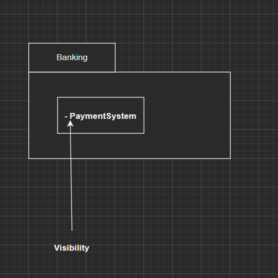

#### Usage

Through the usage of packages you can develop a system horizontally. 
Packages are structuring classes and systems in logical and functional entities. They are building a model that is a great overview of the modular systems that work together.

#### Implementation in C#


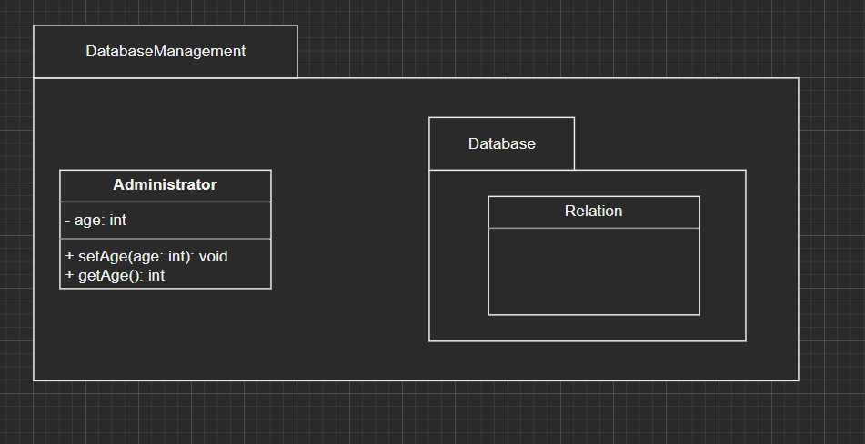

```CSharp
namespace DatabaseManagement{
    public class Administrator{
        private int _age;

        public int Age{
            get => _age;
            set => _age = value;
        }
    }
}
namespace Database {
    public class Relation {
    }
}
```

Even if the ```Database``` namespace is outside the ```DatabaseManagement```, inside the folder structure, it must be inside.

### Package-Import

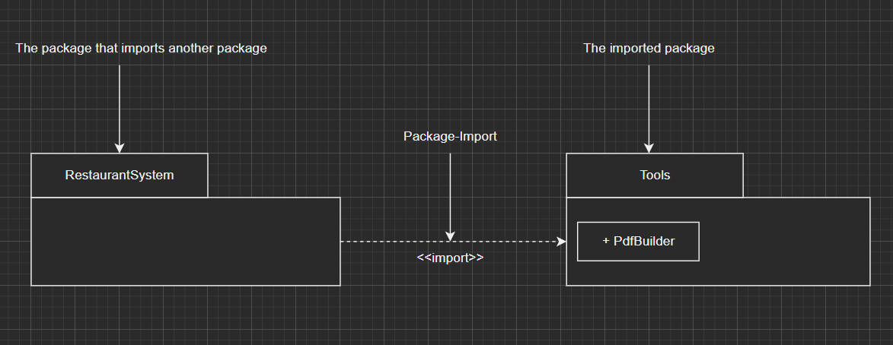

#### Description

A package import is a relationship