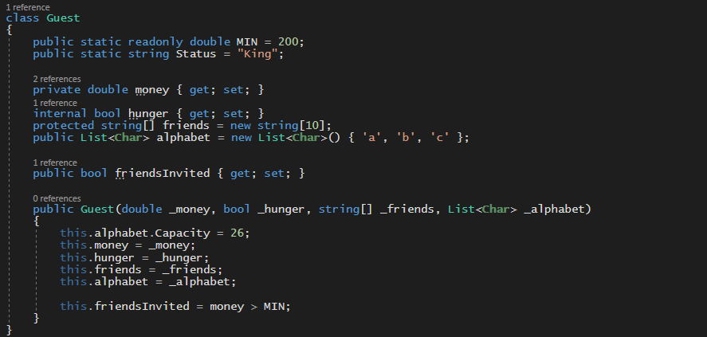
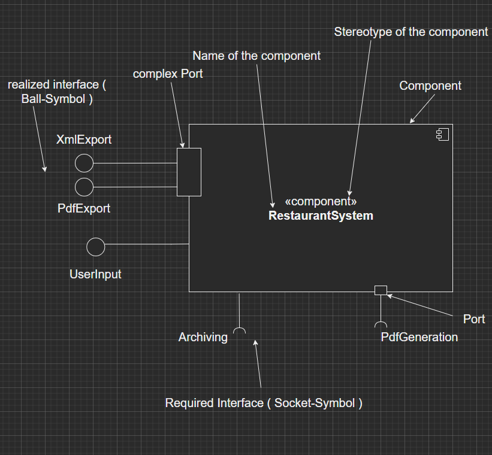
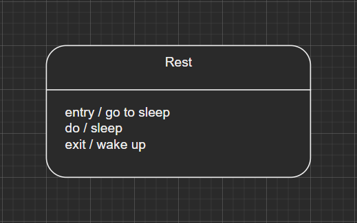
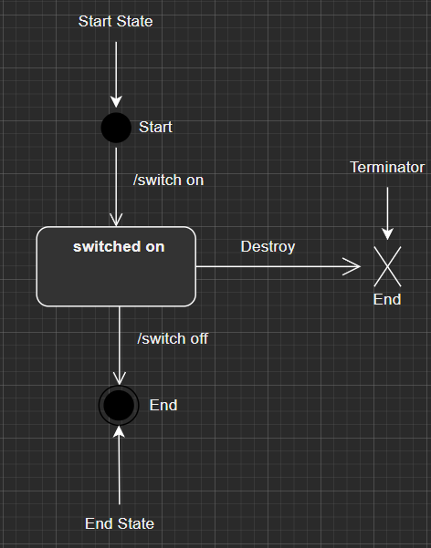

# UML

This repository contains all the chapters of my UML book. Chapters in order:

1. Einführung / Starting out

## Part 1. Strukturdiagramme / Structure Diagrams

2. Klassendiagram / Class diagram
3. Objektdiagramm / Object diagram
4. Kompositionsstrukturdiagramm  / Composite structure diagram
5. Komponentendiagramm / Component Diagram
6. Verteilungsdiagramm / Deployment Diagram
7. Paketdiagram / Package Diagram

## Part 2. Verhaltensdiagramme / Behavioral Diagrams

8. Anwedungsfalldiagramm / Use Case Diagrams
9. Aktivitätsdiagramm / Activity Diagram
10. Zustandsdiagramm / State diagram

## Part 3. Interaktionsdiagramme / Interaction Diagrams

11. Sequenzdiagramm / Sequence diagram
12. Kommunikationsdiagramm / Communication Diagramm
13. Timing-Diagramm 
14. Interakationsübersichtdiagramm / Interaction Overview Diagram

## Part 4. Metamodellierung / UML Meta Modelling
15. Profildiagramm / Profile Diagram

---

## 1. Einführung / Starting out 

The are 6 phases of Software Development are:

- I   Feasibility Study & Requirements Analysis ( Analysis - Phsae )
- II  Design
- III Development & Documentation
- IV  Testing
- V   Deployment / Implementation
- VI  Maintenace & Support

**I Analysis - Phase**

In this phase, detailed analysis is performed to make sure that the software will meet the requirements of the client. This phase is necessarey to make adjustments and to ensure that software functions property at the end. The project team will answer some key questions at this point:

- Can this project actually be completed:
    - On time ?
    - Within budget ? 
    - Within existing staff ?
- Buy vs Build may also be performed at this point. In some cases outsourcing the project might be a more efficient idea 

After the feasibility study we get into the requirements analysis sub-phase where business analysts build a requirements specification that must include : 
- Business Rules
- Security requirements ( roles )
- Use cases
- Sample screen designs & sample reports

These requirements are approved by the customer prior to design work. In this phase, the software architect discusses with all the people involved in the interview with the client about what the requested software can accomplish and with what other system it has to interact with

**II Design** 

Once the first phase is complete, the step of designing takes over, which is basically building the architecture of the project. This step helps remove possible flaws by setting a standard and attempting to stick to it. These are some questions that must be answered in this phase:

* What software architecture is needed ? Is for example a database needed ? 
* How will the UI be designed ? 
* What programming languages and developmental environments are needed ? What do the developers have to know in order to contribute to the project ? When are the workeres available ? 
* What quality assurance measures need to be taken for the project ? 

The models build in this phase serve as a coummunication-foundation etween hte software architects and the programmers

**III Development & Documentation**
This is the coding phase where programmers can use the models from the first 2 phases to build the desired software

**IV Testing**
Before the project can be deployed, a critical phase of testing must start first, where the desired software is examined in order to ensure the system works properly.

**V Deployment / Implementation**
After a successful testing phase, the software gets deployed to the customer

**VI Maintenance & Support**
Once the software passes through all the stages without any issues, a maintenace process is followed wherein it will be maintained and upgraded from time to time to adapt to changes.

* Help desk is usuall formed to suport users problems and questions
* Software fixes are developed at this point
* Patching and maintenance operations begin

# Part 1. Strukturdiagramme / Structure Diagrams

#  2. Klassendiagram / Class diagram

#### Attributes / Properties

There are 2 types of properties:

* Instance Properties
* Class Properites ( underlined )

Class properties are static properties and they are underlined inside the class diagram.
This is the structure for every property inside class diagrams:

**[Visibility][/]Name[:Type][Multiplicity][:Default Value][{Property}]**


1. Visibility 
   - \+ = public
   - \- = private
   - \# = protected
   - ~ = package ( only visible for classes insied the same package )
<br/>
2. /
    The attribute can be derived out of other properties inside the class. It doesn't have to be stored on its own ( we don't need it inside the constructor ).
     Let's say that you have value x = a + b where only a & b are properties needed in the class without /, x is made out of them so we don't need x inside of the constructor
<br/> 
3. Name
    The name of the property. You can follow special styling guides for the programming language you're using
<br/> 
4. : Type
    The type of the property
<br/> 
5. Multiplicity
    It describes the amount of elements that fit into that property. 
    Example:
    * [1] <> only one element
    * [1..2] <> one or two elements 
    * [1..*] <> at least one element must be present
    * [0..*] or [*]  no boundaries
<br/> 
6. = Default Value
    The default value of the property if it's not given
<br/> 
7. {Property}
Every property can have it's own properties. This properties are used to describe specific features and traits of the attributes inside the class diagram. Here are the properties that you must know:

* {id} - makes the property act as a key of the class. It's used exactly like an id inside relational databases
* {readOnly} - The property can only be read. New values can not be assigned to the property
* {subsets \<Property-Name>} - The property is a subset of another property
* {union} - Opposite of {subsets \<Property-Name>}. It combines all the properties that have the {subsets \<Property-Name>} property. Example:


* {redefines \<Property-Name>} - redefines a property from the class. This property can only be used inside inherited class diagrams ( e.g. overriden properties in C# )
* {ordered} signals that the property is ordered
* {seq} or {sequence} signals that the property is a sequence of elements
* {unique} means that there ar eno elements repeating themselves
* {nonunique} is the oppposite of {unique}
* {composite} defines that the property is built out of more parts and it needs these parts in order to become a whole. The property is responsible for adding and deleting its own parts. This property, {composite} of properties if essentially used when working with composition relationships between class diagrams


Example of a class diagram with properties in code ( C# ):


Code in C#:



#### Operations / Methods

Like properties, there are 2 types of methods:

* Instance Methods
* Class Methods ( underlined )

The UML structure for methods is :

**[Visibility]Name([Parameter-List])[:ReturnValueType][Multiplicity][{Property}]**

1. Visibility 
   - \+ = public
   - \- = private
   - \# = protected
   - ~ = package ( only visible for classes insied the same package )
<br/>
2. Name
    The name of the method. You can follow special styling guides for the programming language you're using
<br/>
3. [Parameter-List]
    This is a list of arguments that the method might need
    This is the structure of argument :

        [Passing-Style]Name:Type[Multiplicity][=DefaultValue][{Property}]
        
    - Passing Style
        * in - the argument can only be read inside the method, it's read-only
        * out - the argument can't be read, it can only be written by the method ( usually used as a return value )
        * inout - the argument can be rad and written by the method
    
    - Name
        The name of the argument
    
    - :Type
        The type of the argument
    
    - Multiplicity
        It describes the amount of elements that fit into that property. 
        Example:
        * [1] <> only one element
        * [1..2] <> one or two elements 
        * [1..*] <> at least one element must be present
        * [0..*] or [*]  no boundaries

    - = Default Value
        The default value of the property if it's not given
    
    - {Property}
        The property of the argument ( see properties of class diagram above )
<br/>    
4. ReturnValueType
    The type of the return value
<br/>
5. Multiplicity
    It describes the amount of elements that fit into that property. 
    Example:
    * [1] <> only one element
    * [1..2] <> one or two elements 
    * [1..*] <> at least one element must be present
    * [0..*] or [*]  no boundaries
<br/>
6. {Property}
    Special properties of the return value ( see properties of class diagram above )

#### Binary Association

A binary association represents two class diagrams that "know" about each other.


In this example, Guest can interact with Restaurant and vice-versa.

#### Association name and reading direction


#### Multiplicity of associations


One Guest can visit only one restaurant.
One Restaurant can contain up to 50 Guests

#### Association Roles

You can use association roles in order to describe the role of a class in a relation/association with another class
Let's say that a smal compnay buys something from a big company and then sells it to you.


#### What is an association end ?

An association end is a connection between the line depicting an association and the icon depicting the connected classifier.

#### Association properties

* {subsets \<Association-End>} - shows that the association end subsets another classifier
* {union} - unifies all the association ends with {subsets}
* {redefines \<Association-End>} - redefines another association end
* {ordered} signals that the classifier must be ordered. Example:


The menu has to be served by the waiter in an ordered manner ( not dessert first. )

* {nonunique} means that the association end can repeat itself
* {sequence} or {seq} means that the association ends points at a sequence of objects

These properties are strictly for association ends and they determine for example how the classifiers are built when we use properties like {seq} and {ordered}. The association ends in that case points at an ordered sequence.

#### Constraints:

An XOR constraint specifies that only one of the two associations can exist at the same time:


#### Association Navigation

There are 3 types of navigation:
    * navigable
    * not navigable
    * unspecified

#### Bidirectional Navigation

A bidirectional navigation allows both classes to know each other. They can both interact with each other


Example:


Code ( C# ):


#### Prohibited Navigation

A prohibited navigation means that the classes don't know each other and aren't allowed to interact with each other


#### Unspecified Navigation

By using an unspecified navigation we avoid setting a strict prohibition or a force navigation between the elements. The navigation between the cases is allowed but not mendatory


#### Unidirectional Navigation

A unidirectional navigation allows the navigation only on one side


#### Partial Navigation

A partial navigation is only partially defined. On one side, the navigation is direct while on the other side it is not defined, the interaction between the classes on the undefined side is possible but not mendatory


In this example the thief knows about the police and can interact with them. Police on the other side might or might not know about him and be able to interact with him.

#### Ownership

The ownership navigation sohws, as the name says, that a class owns anohter class. In this case the dish, which acts as a product is owned by the guest, which is a consumer


#### Reflexive Association

Reflexive associations are associations between classes and themselves, it's when a class has an instances of itself inside itself


Code ( C# ):


#### N-ary Association

An n-ary association is an association between multiple classes. Most programming language don't have a support for this type of association, so you'll have to build a special class instead of the n-ray association.


#### Qualified Association

A qualified association needs a qualifier that will be used on the first class in order to reference the second class. The qualifier will work like a foreign key does in databases.


#### Association Class

In certain cases you might have some properties or methods that don't match the ideas of the classes that you've built, so you might want to build an association class because that's where they fit best. You might also want to be more specific about the association and make a class for it


You don't have to name the association if you have the association class but if you do, they both must have the same name

In this case MenuPoint wouldn't have matched the ideas of the two classes, Waiter and Chef, so it was in our best interest to creat an association class.


#### Aggregation

The aggregation is a special form of binary association where you have one single Whole and more parts that together build the whole. In the case of aggregation, the whole can still exist if some parts are remove and vice-versa. The parts can exist individually without the whole.


In this examle the restaurant which is the whole, has an aggergation built with table & chair. A restaurant is still a restaurant even without tables and chairs. A table and a chair can still eixst individually outside restaurants....

#### Composition

A composition is strong form of aggergation where the whole can't exist without all the parts.


#### Dependency

A dependency is a Client-Supplier association and **servers for documentation purposes only**. It signals that a class needs another class for its specification or implementation.


There are several types of dependencies:

* \<\<call>> = this type of dependency signifies that the client calls at least one operation/method from the supplier
* \<\<create>> = this dependency signifies that instances of the client generate instance of the supplier
* \<\<derive>> = the client can derive from the supplier
* \<\<instantiate>> = specifies that the client is an instance of the supplier and it is mostly used between classes and object diagrams
* \<\<permit>> = it grants the client access to all the properties and methods of the supplier. In our case the tax inspector will have access to the private property Profit of the Restaurant
* \<\<refine>> = this dependency signals a refined specification of a class that. This dependency can be used for example in hte implementation phase when you want to refine a class that has already been modelled from the design phase.
* \<\<substitute>> = the client can completely replace the supplier without the need of an inheritance relationship
* \<\<trace>> = this dependency signals that both classes represent the same concept in different models\<
* \<\<use>> = the existence of the supplier is needed by the client in order to function properly

#### Inheritance


You can build inheritance groups and also name them.


Inheritance groups also have properties:

* {complete, disjoint}

This property means that the group is complete. An instance cannot be classified as only the upper-class and it can't be classified as more than one class at the exact time


A person can only be a man or a woman. You can only have instance of the man or woman, not of the person. On top of that a person can't be a man and a female at the same time

* {incomplete, overlapping}

In this case, an instace can be member of the upper-class and/or any number of subclasses. The classification of "instance" is incomplete. Sometimes there are sub-classes involved, sometimes not.


We could also have a teenage or youngadult class, which makes the group incomplete. On top of that you can have an instance that is both a Person & a kid or a person & adult or a person alone or a kid & adult which would make the person a teenager.

* {incomplete, disjoint} **DEFAULT if not given**
The group is not complete and the sub classes can't share instances

* {compete, overlapping}
The group is complete and the sub classes can share instances

#### Stereotypes

Stereotypes can be used in all diagram types in UML. They don't change the meaning of the diagram, thye just give information about the purpose and role of that model. Example:


Here are the most important stereotypes:

* \<\<auxiliary>> = the aim of the class is to help other classes in the program. They are usually used together with \<\<focus>>
* \<\<focus>> = these classes build the logic of the program and they are helped by classes with the \<\<auxiliary>> stereotype
* \<\<interface>> = defines an interface
* \<\<utility>> = you can't build instance out of this class. It just serves as a toolbox for other classes. Example:


* \<\<dataType>> = you can define new data types that are unknown to uml
* \<\<enumeration>> or \<\<enum>> = defines an enum

You can also build your own stereotypes:


#### Abstract Class

In order to build an abstract class you have to add {abstract} below its name inside the class diagram. An abstract class deifnes the future blueprint for a class:


#### Template

Templates are built exactly like in C# ( generics )


In order to build osmething out of a collection you must use bind:

**\<\<bind>>\<Template-Parameter-Name -> first_parameter, ..>**

Code example:


Code C# :


#### Interfaces

In order to build an interface you must use the \<\<inteface>> stereotype:


You can use interface in 2 ways:

* realized interfaces
* required interfaces

Realized interfaces are working as upper classes:


C# code:


Required interfaces don't server as upper-classes but they are needed for classes to work


Java code:

```Java
interface Food{}
class Dish {
    public Food dish_food;G$
}
```

You can also mix the types of interfaces that you use:


# 3. Objektdiagramm / Object diagram

Class diagrams are used to build the blueprint for objects. We use object diagrams to represent those objects. We can use the dependency \<instantiate> between a class diagram and an object diagram to show where the object diagram came from. Object diagrams are used in different stages of the program to represent an objects state. If no object diagrams have been built based on a class diagram, then it's probably a good idea to delete the class diagram. Object diagrams also help verify the correctitude of class diagrams.

Example for object diagram:


Object diagrams, just like class diagrams, can build connections with each other. However, in this case, they are not called "associations" anymore, we call them ***links***. If two class diagrams build an association between each other, then a link between their object diagrams must be built as well. This is not a rule but if two classes are associated with each other, then it's only logical that the object diagrams should too. If this is not the case then maybe we should change something inside the class diagram. Maybe the association between the classes is not correct. Links have everything that associations have ( association name, roles, reading direction, etc. ). The only thing different is the multiplicity, since one object tcan only link to one single object. If you want to link one object to 3 more objects, then you can build more links. Here is an example of an object diagram with links:


# 4. Kompositionsstrukturdiagramm  / Composite structure diagram

### 1. Part

Composite structure diagrams show how components work together inside a class. They show the internal structure of a class. They are also called architecture diagrams.

A Part is used to model a subset of components that might be contained inside a class.
Example:


Even if a football match technically needs more people in order to function, the part ```Footballers``` represents only a small subset of all the objects of the class ```Person``` inside the class ```FootballMatch```.
If a part has no relationship with other parts then it is build with a dashed line around itself.


The following example using a class diagram with composition might make the use cases of parts clearer:


In this class diagram you can see the broad class structure and you can see that a ```FootballMatch``` needs 22 object of the class ```Person``` and it might also interact with a ```Ball```, but you don't know exactly how the classes ```Person``` and ```Ball``` interact with each other internally. This is what we are using the composite structure diagram for. It reveals how the internal components of a class interact with each other and helps us visualize those actions much better than a class diagram can do. Here is the composite structure diagram for the ```FootballMatch``` that shows how the classes ```Person``` and ```Ball``` interact with each other, interally:


Parts are used to desribe the internal use of classes and help you visualize a model for a specific context that you wouldn't otherwise be able to, outside of a composite structure diagram.

### 2. Port and connector

A port describes an interaction point between parts, interfaces, classes, and so on inside a composite structure diagram. Connectors connect parts and ports.

Here is an example:


In this example the TV and the CableConnection are the parts. We have a connector that connects two ports with each other. One port is the port AntennaInput, that comes from the TV part and the other port is the AntennaOutput port that comes from the CableConnection part.

Connectors don't have to always connects components of the same type ( port, part, interface, etc. ), they can also connect a port and a part together, for example:


In this example, the connector with the name SatCable connects the SatInput port from the SatReceiver part with the SatAntenna part.
That means that the SatCable connects directly to the SatAntenna, it doesn't need a port like the SatReceiver needs the port SatInput.

Interfaces can also be used in composite structure diagrams. Interfaces can be of two types in this type of diagram:

* Realized interfaces : these interfaces work basically as upper-classes. They are needed for the implementation and they are drawn with a ball-symbol.
* Required interfaces : these interfaces aren't used as upper-classes, they are still needed for the implementation but the component that uses this interface, doesn't need to inherit from it. This type of interfaces are drawn using a socket-symbol.

Here is an example:


It is also possible to define muliple interfaces to one single port. When multiple interfaces are assigned to a port, that port now has become a **complex port**.

Example:


A behavior port is a port that connects certain components ( part, ports, interfaces, etc. ) to a certain state of the classifier it belongs to ( the 'classifier' is the 'class' that it belongs to )


In this example the port with the name 'p' interacts with 2 interfaces ( powertrain and power ). The port is a behavior port since the interfaces that the port interacts with are in direct connection with a certain state of the engine ( for brevary that state could be on/off ).

Here is the UML diagram for an example containing a behavior port:


Here is an example of a composite structure diagram in C#:


```CSharp
public class Program
{
    static void Main(string[] args)
    {
        SatReceiver sat = new SatReceiver();

        Console.WriteLine(sat.scartConnection.GetTvSignal("sender1"));
        Console.WriteLine(sat.scartConnection.GetTvSignal("sender2"));
        Console.WriteLine(sat.scartConnection.GetTvSignal("sender3"));
    }
}
public interface TvSignal
{
    string GetTvSignal(string sender);
}
public class SatReceiver
{
    private string signalSender1;
    private string signalSender2;
    private string GetSignalSender1() => signalSender1;
    private string GetSignalSender2() => signalSender2;

    public class ScartConnection : TvSignal
    {
        private readonly SatReceiver satReceiver;

        public ScartConnection(SatReceiver satReceiver) => this.satReceiver = satReceiver;

        public String GetTvSignal(string sender)
        {
            switch (sender)
            {
                case "sender1":
                    return this.satReceiver.GetSignalSender1();
                case "sender2":
                    return this.satReceiver.GetSignalSender2();
                default:
                    return "Error";
            }
        }
    }

    public ScartConnection scartConnection { get; private set; }
    public SatReceiver()
    {
        signalSender1 = "Tv signal from sender 1";
        signalSender2 = "Tv signal from sender 2";
        scartConnection = new ScartConnection(this);
    }
}
```

### 3. Collaboration

Collaborations describe the structure of objects, that work together to accomplish a certain task inside the classifier. These objects play a **role** in the collaboration that helps accomplish that task. The roles can be connected through normal connections, that we've already learned.

The idea behind a collaboration is to see what are the elements that work together internally, inside a classifier, in order to accomplish a certain task.

Here is an example:


Inside the collaboration **Sale**, you need two objects that takes the roles of **buyer** and **salesperson**. The connection specifies that the two objects must communicate so that a **sale** can take place.

If certain roles need certain properties/method in order to play the role of the collaboration tha take take part of, you can describe that situation like this:


In this case, we need an object that contains the property ```moneyAmount``` in order for that object to act as the role of a **buyer**. We also need an object that contains the property ```offer``` in order for that object to complete the role of a **salesperson**.

### 4. Collaboration Application

With a collaboration application, you can take the use of an already existing collaboration and use that in a specific situation. 
You can think about a collaboration application as an instance of a collaboration. 

Here is an example:


In the example before this one we've had the collaboration ```Sale```. Now, this collaboration application with the name **FootballTicketsSale**, implements the collaboration that we've already seen, that being **Sale**. You can see that the roles **Buyer** and **Salesperson** haven't changed, since they are not allowed to.

There is also an alternative notation for the collaboration application:


You can have more collaborations in an collaboration application, you aren't restricted to only rely on one single collaboration.


# 5. Komponentendiagramm / Component Diagram

### Components

Component diagrams are widely used in software architecture. They are usually used in parallel with Deployment Diagrams.

Here is what a component looks like and how it interacts with the outside assemblies:



A component represents an element of a system. Its behavior can be represented by the realized and required interfaces that it works with. Interfaces can be bound to ports, just like a Composite structure diagram ( Chapter 4 ). 

There are alternative ways of notation elements for interfaces. You can also use inheritence and ```<<use>>``` dependency for interfaces, which is a lot more verbose:


There are also other ways of representing interfaces that are bound to your components. Another way of doing it is the **Black-Box-Vision**:


Components can also contain other components themselves. They usually have the ```<<subsystem>>``` stereotype. Here are all stereotypes that a component can have and their meaning:

* ```<<implement>>```. This type of component doesn't contain any personal specification. It repreesnts the implementation of other components that have the ```<<specification>>``` stereotype.
* ```<<specification>>```. These components represent a provided interface. They realization is done by ```<<implement>>``` components.
* ```<<entity>>``` This represents components that contain persistent information, something like a database for example.
* ```<<process>>```. A processed component is a transaction-based component that works with the ACID-principle:
    * Atomic: The components either complete their actions or they don't. If a runtime error occurs, all the changes that have made up to that point will be reversed
    * Consistent: All the data is in a consistent state before and after the actions have started
    * Isolated: Every action will be executed in isolation. That means that it is invisible to other transactions.
    * Durability: Every change made to files will be permanently saved
* ```<<service>>```. The ```<<service>>``` components are stateless, functional components that provide services for other components
* ```<<subsystem>>```. A component that uses the ```<<subsystem>>``` stereotype is used usually used to decompose bigger systems. They represent a small portion of bigger systems.
* ```<<buildComponent>>```. These are components that are not a part of the development system but they are needed in order to build it. These can be IDEs, Compilers or VCS.

You can also expand the black box vision and design everything that there is to a component in one single box. This is called the **White box vision**:


### Connector

There are 2 types of connectors when it comes to component diagrams:

* Assembly Connector
* Delegation Connector

An **Assembly Connector** represents the connection between two components and specifies that a component needs services from another component.

Assembly connectors are, as you've already seen, used with the ball-and-socket symbol. 

A **Delegation Connetor** represents a connection between an external interface or port and an internal component of another component.

Here is an example of assembly- and delegation connectors:


### Artifcats

An artifact is a physical information entity that is needed or built in the development process.

These can be:

* Files with source code
* ```.exe``` files
* Databases
* Tables of databases
* written documentation
* UML-Models
* E-Mails
* etc.

Here is an exmaple of how an artifact looks like:


An artifact can have different types of stereotypes:

* ```<<script>>```. This is a script file ( e.g. javascript or php-file)
* ```<<source>>```. A ```<<source>>``` file contains source code and can be compiled by  an ```<<executable>>``` file
* ```<<executable>>```. This stereotype represents an executable file. On the Windows OS this would be an ```.exe``` file, on Linux it would be a ```.bin``` file.
* ```<<document>>```. This artifact represents a document that is neither ```<<source>>``` nor ```<<executable>>```. This artifact is usually a document that can't be assigned to other stereotypes.
* ```<<file>>```. This is a general file
* ```<<library>>```. This represents a library of code ( this could contain classes, functions, etc. ).

Artifact can also contain other internal artifacts.
In order to show that an artifact is used by a component you can add the stereotype ```<<manifest>>``` to the Manifest-Connection.


If you want to describe the manifest-connection in more detail you can use the following stereotypes:

* ```<<tool-generated>>```. The artifact was generated by a tool. There are a lot of tools, for example, that can generate artifacts directly from UML Diagrams.
* ```<<custom code>>```. The artifact was custom written by a user.


# 6. Verteilungsdiagramm / Deployment Diagram

### Applications of the diagram

A deployment diagram is used to specify hardware and software environments and the connections between each component. Deployment diagrams are usually used in combination with component diagrams. They are usually used in the design phase.

By using deployment diagrams you can build the architecture of the software and prepare and test the hardware and software environments.

### Notation elements.

### Nodes

**A node represents a system resource.**

A node contains the name of the object and its class ( the name is optional, but the class not ).

Example:


### Nodes stereotypes

Nodes can use stereotypes in order to thoroughly describe their functionality:

* ```<<device>>``` - A ```<<device>>``` node represents a physical component ( hardware ).


* ```<<exeuction environment>>``` - This type of node represents an execution environment. That can be for example a tomcat server for java applets or even an entire OS.

* ```<<application server>>``` - This is a node that provides an application for another node of type ```<<client workstation>>``` and mostly contains one or more nodes of type ```<<execution environment>>```. 

* ```<<client workstation>>``` - This node takes the services of an application provided by a node of the ```<<application server>>``` type. Nodes of type ```<<client workstation>>``` and ```<<application server>>``` are usually modeled together.

* ```<<mobile device>>``` - These are mobile devices like Notebooks or phones for example.

* ```<<embedded device>>``` - There are devices that are embedded in other devices.

### Node properties and methods

**Nodes can contain attributes/properties and methods:**


### Internal nodes and artifacts

**Nodes can also contain other nodes or artifacts inside of them:**


In the example above we have an application server HP ProLiant SL that contains the execution environment Tomcat and that execution environment has an artifact called *PdfCreation.class*.

### Deployment Dependency

In order to show that an artifact is getting deployed inside an execution environment, you must use the *deploy*-dependency:


### Deployment Specification

You can also give more information to the dependency between two nodes.

A **Deployment Specification** defines execution parameters of an artifact in a node. It is usually placed on the deployment dependency with the execution parameters as their attributes/properties. *The execution parameters can also be placed directly inside of the artifact, if needed*.

Example:


### Communication Path

A *communication path* describes an association between two notes. The associations are the same as the associations in a normal class diagram ( it can contain a name, reading direction, multiplicity, roles, it can be of different types, etc. ).

Example:


# 7. Paketdiagram / Package Diagram

## Use Cases

Package diagrams are used in the early phases of software development (like analysis or design ) in order to structure the model vertically as well as horizontally.

Through horizontal structuring we mean the opportunity to bundle UML elements that work together in packages.

Packages can have sub-packages and that is the vertical structuring. The packages on the top can contain the whole project while the sub-packages at the bottom can describe the details of the project.

With the help of vertical structuring we can build certain levels of abstraction of a model and we also have the possibility to zoom into the details if needed.

You should structure your model horizontally and vertically in order to build a certain case of abstraction and make it easier to use and understand.

## Notation elements

### Package

#### Description


Package diagrams group elements together and namespaces that pack these elements together.
In the package diagram above you can see the pacakge ```DataManagement``` that contains the class ```Administrator``` and another sub-package ```Database```.

There is also another notation for package diagrams:


The above diagrams are semantically the same.

All the elements inside a package **must** have different names. Although, elements that are in different packages can have names that are the same.


The sub-packages with the same name in these 2 different packages can't however be identified using theyr ***unqualified name*** ( ```Database``` ) since they can't be differentiated. In this case you have to use their ***qualified name*** which means adding the name of their package followed by 2 colons and the name of the sub-package: ***```DataManagement::Database```*** and ***```RestaurantSystem::Database```***.

The elements from a package are not separable from the package. If you delete a package, you delete all the elements inside of it automatically.

Even if you can't see any elements inside a package that doesn't mean that it's empty. UML allows you to hide certain arbitrary sub-packages in order to make the diagram clear.

All the elements of a package are visible to one another. Just like in class diagrams, the visibility of an element inside a package diagram can be change using:

* ```public (+)```
* ```private (-)```
* ```protected (#)```

If you don't specify the visibility level of a package, it will automatically be ```public (+)```.

Example:


#### Usage

Through the usage of packages you can develop a system horizontally. 
Packages are structuring classes and systems in logical and functional entities. They are building a model that is a great overview of the modular systems that work together.

#### Implementation in C#


```CSharp
namespace DatabaseManagement{
    public class Administrator{
        private int _age;

        public int Age{
            get => _age;
            set => _age = value;
        }
    }
}
namespace Database {
    public class Relation {
    }
}
```

Even if the ```Database``` namespace is outside the ```DatabaseManagement```, inside the folder structure, it must be inside.

### Package-Import


#### Description

***A package import is a relationship that makes all the public elements of the package that is imported available inside the package that imports.***

This works just like an import in programming.

The imported elements are imported without a qualified name. They are imported in such a way as if the package that imported the other package would already have them. If the imported package gets deleted from the model, the elements still stay inside the package that imported.
In the diagram above, the ```RestaurantSystem``` can use the ```PdfBuilder``` without a qualified name, it can be used as if it would be already part of the ```RestaurantSystem``` package. However, all the other packages that want to use the ```PdfBuilder``` without importing the ```Tools``` package, they can only reference it using the qualified name : ```Tools::PdfBuilder```.

The imported items are public inside the package that imported them. This is how they can be imported again.


In the diagram above diagram, inside the package diagram ```RestaurantChain``` you can use the ```PdfBuilder``` directly using its unqualified name. It is in ```Tools``` andd also in ```RestaurantSystem``` public.

To prevent this, the UML provides ```Package-Access``` as a constraint on the package import.


***A package access is a relation that adds all public element names of a package to the importing package as private.***

Despite the ```<<import>>```-relationship between ```RestaurantChain``` and ```RestaurantSystem```, this will not allow ```RestaurantChain``` to access the pdf creator by its unqualified name.

#### Usage

Use package imports when you need to use packages in other packages. Package import help you better define the system and the relationships between the packages.

### Package-Merge


> ***A package merge defines a relationship between two packages where the non-private contents of the destination/target package are merged with the contents of the source package.***

In the example above the contents of the package ```GuestManagement``` are merged with the contest of the package ```VipGuestManagement```.

In principle, a merge relationship represents an abbreviated notation for all the transformations required when merging the target package with the source package. The following example illustrates the principle operation of a package merge and shows the corresponding transformations.


In the upper part of the figure, a packet merge of packet P2 into packet P1 is modeled. Packet P1 defines an element A, packet P2 defines an element B.

The lower part of the figure shows the effects of the merge on package P1. The original existing element A remains intact as expected. Since element B did not previously exist in P1, a new element B is defined that specializes element B of package P2 (P2::B) and thus has all the attributes and operations of element P2::B according to the rules of generalization.

But what happens if both packages already contain elements with the same names?

In the upper part of the following figure, packages P1 and P2 both contain an element A. In a package merge, a generalization relation is added between the element from package P2 (P2::A) and the element from package P1 (A), as shown in the lower part of the figure.

Thus, element A extends its own attributes and operations by those of element P2::A. Thus, a new element is created which, according to the rules of generalization, has all the attributes and operations of the elements P1::A and P2::A.


Let's consider another example where an empty package merges two other packages, both containing the same element.


In the figure above, the two packets P1 and P2, each defining an element A, are merged into an empty packet P3. The merge defines a new element A that inherits from P1::A and P2::A and thus combines all attributes and operations of both elements according to the rules of generalization.

It is quite common that generalizations and associations are already defined in the individual packages. A merge relationship does not change the generalizations and associations.

It only changes the elements that participate in them, which is illustrated by the example in the following figure.


## Usage

Merge relationships are used when there are packages in the model whose contents and concepts complement each other and can therefore be combined to form a new whole.

However, you should check the resulting inheritance hierarchy carefully so that the use of the merge relationship can also have undesirable effects.


---

# Part 2. Verhaltensdiagramme / Behavioral Diagrams

---

# 8. Anwedungsfalldiagramm / Use Case Diagrams

## Applications

Use case diagrams model the functionality of the system at a high level of abstraction from the so-called black box view of the user. Only those use cases are defined that an external user can perceive and whose execution brings him a recognizable benefit.

The modeling describes what use cases the system offers and not how they are realized in the system. Thus, neither an order in which the use cases should be retrieved nor what actually happens during the use cases in the system is modeled. The foksu is placed on what a user can expect from the system.

For example, it is interesting for a guest that he can order a dish in a restaurant. However, it is insignificant for him how his order is passed from the waiter to the cook and how many cooks are involved in the preparation.

Use case diagrams are mainly used during analysis and definition in the early stages of a software project. They are used to capture and document user requirements. Based on the modeling results, requirements for the system are discussed with the users and/or customers and checked for completeness and correctness. For this reason, use case diagrams use only a few notation elements and should also be kept as simple as possible.

Starting from the use case diagrams, which represent a rough view of the functionality of the system, the dynamic verification can be refined and specified in a top-down process by using further behavior diagrams.

## Notation Elements

### System Boundary

#### Description

***The system boundary includes a system that provides the required use cases and with which users interact.***

All elements that are platted within the system boundaries represent components of the system. For example, if use cases are modeled within the system boundaries, the system must provide the specified functionality.


#### Usage

Modeling a system boundary is not required by UML. However, it is recommended to delimit the software system from its actors and external systems.

### Actor


#### Description

***An actor models a type or role that an external user or system assumes while interacting with a system.***

The figure shows an example of a human actor ```Guest``` as well as a system ```Credit Card Company```. The UML does not forbid to use the rectangle notation also for humans or the stickman notation for further systems.

Actors are always modeled outside the system boundaries. This can be seen in the following figure.

An actor does not necessarily have to represent a single physical insatnce. Different users or external systems can act in changing roles towards the system depending on their current function. For example, the same person who in the above illustration today acts as a waiter may tomorrow be a guest in the restaurant.

#### Usage

Model actors to model users of a system or further external systems involved in interactions with the system.

Keep in mind that actors do not define physical entities of people or systems, but roles with respect to the modeled system.

### Use Case


#### Description

***A use case specifies a self-contained set of actions provided by a system that yields a recognizable user for one or more actors.***

Application cases define that a functionality is provided without specifying how this is to be done.

For example, the use case in the figure above defines that a dish can be ordered without expressing what individual actions are involved or in what order and by whom the actions must be performed (e.g., call waiter, communicate order, forward order to cook, etc.). )

As shown in the next figure, UML allows use cases to be written in three ways. Semantically, there is no difference between the three notation types shown.


The positioning of use cases within system boundaries defines which use cases are provided by which systems. The following figure models that the use case ```Order Food``` is provided by the system ```Restaurant```:


#### Usage

Use cases are mostly used to model an initial rough view of the functional requirements for a system. Therefore, combine actions that lead to a single result visible to the actor into a single use case as well.

Keep in mind that use cases are intended to facilitate communication between users/clients and the software engineer, so refrain from dividing use cases too finely.

For this purpose, it is often helpful to imagine the perceivable functionality of the system from the user's point of view or, if possible, to have him explain a view himself so as not to get caught up in modeling technical details or processes.

### Association


#### Description

***An association models a relationship between actors and use cases in use case diagrams.***

These are the binary associations already known from class diagrams. As expected, they can also be provided with multiplicities or navigation directions. N-ary associations are not used in use case diagrams.

The use case diagram from the figure above models a guest who can order one to any number of dishes from a waiter in a restaurant. However, a dish is ordered by only one guest at a time from a waiter.

Modeling associations between a use case and multiple acetuers requires that all actors with an association to the particular use case are needed to execute the use case. The figure above specifies that both a guest and a waiter are required to execute the Order Dish use case.

A directed association specifies the allowed communication direction between the use case and the actor. In the figure above, for example, it defines that a waiter must be involved in the use case, but he cannot initiate the use case himself. Communication can only be unidirectional from the use case to the waiter.

Between the guest and the court order, the navigation and thus communication direction remains unspecified, which allows bidirectional communication between them. A guest can thus both call the use case and receive information from it.

#### Usage

Use associations to model which use cases may be executed by which actors.

### Generalization/Specialization

#### Description

***A generalization can be modeled in use case diagrams between actors or use cases and defines a relationship between a specific and a general element.***


The figure above shows a use case diagram, which is a generalization already known from class diagrams.

A guest has an association to the use case Pay the bill. The VipGuest that specializes it inherits all of its capabilities and is thus allowed to use the use case as well, even if no direct association between VipGuest and Pay the bill is modeled.

Additionally, a VipGuest may request a personal waiter, which is not allowed for the simple Guest.

The Pay the bill use case is specialized by the Pay with the credit card use case. The set of actions defined in Pay the bill is thus inherited and refined by the Pay with the credit card use case.

The association of Pay the bill to Guest is also inherited. A Guest and a VipGuest can thus also pay with credit card, even if no separate associations have been modeled between them and the specializing use case.

#### Usage

Generalizations and specializations allow to hierarchically order and reuse use cases with similar functionalities.

In the context of actors, generalizations/specializations are mostly used to model different rights and to highlight their relationship (example: user and administrator).

### Include-Relationship


#### Description

***An include relationship models the unconditional inclusion of the functionality of one use case in another use case.***

Each time the embedding use case is executed, the embedded use case must also be called. The including use case depends on the execution result of the including use case and is therefore not complete without it. Overall, the include relationship can also be compared to calling a sub-function.

A use case can be included by any number of use cases and can also include use cases itself (however, be careful not to let cycles occur).

The include relationship from the figure above models that the Pay with the credit card use case includes the functionality of the Check credit card use case. Each time a payment is made with the credit card, the credit card must be checked. The functionality of the Pay with credit card use case depends on the result of the credit card check and cannot be performed without it.

#### Usage

The include relationship is mostly used when reusing use cases. Often there are use cases in the model with the same sub-functionality that can be separated out as a stand-alone use case and maintained centrally.

It clarifies the relationships between the use cases and increases the expressiveness of the diagram.

As was mentioned earlier, the include relationship can be viewed as a type of subfunction call, where the unte function is a complete use case. When modeling, keep in mind that use cases represent the functionality of a system in an overview fashion, and do not succumb to the temptation to model actual unte function calls in terms of program flow.

### Extend-Relationship


#### Description

***An Extend relationship models the conditional inclusion of the functionality of one use case into another use case.***

The functionality of the extending use case can be included in the functionality of the extended use case at the extension point. Unlike an include relationship, the extending use case is independent of the extending use case and can be executed without it.

A use case can extend any number of other use cases and can itself be extended by other use cases. (Again, be careful not to create cycles).

The list of possible extension points is noted below a hyphen with the heading >extension points<. An optional annotation at the extend relation specifies the extension point at which the extending use case can be inserted, and the condition when this happens. The functionality of the extending use case is invoked if this condition evaluates to true during the execution of the extended use case or if no condition is specified. ( In this case it is actually a <<include>> relationship, since the functionality of the extending use case is always called).

In the example of the figure above, the use case >Call the police< extends the use case >Pay the bill<, expressing that in the course of payment the police can be called. A bill can just as well be paid without calling the police.

The extension point is defined in the use case >Pay the bill< with >Amount Acceptance<. The associated annotation indicates that the extension will be performed and thus the police will be called if the amount received is keliner than the actual price.

#### Usage

The Extend relationship allows to reuse use cases with partial functionality and to highlight the dependencies between them. Unlike the include relationship, the functionality of the extending use case does not have to be included.

Although the Extend relationship allows a kind of >>If-Then-Else modeling<<, it is not recommended to model program flows at this point. It is recommended to get an overview of the required functionalities of the sytem by using use case diagrams before modeling the details with further behavior diagrams.

# 9. Aktivitätsdiagramm / Activity Diagram

## Use Cases

Activity diagrams offer many possibilities to model the behavior of systems. They provide numerous notational elements that can be used to model the following examples:

* alternative sequences,
* sequences of activities,
* parallel activities,
* interleaved activities,
* areas of responsibility or
* exceptions and their handling

Activity diagrams can be used in all phases of software development:

* During the **analysis/definition phase**, activity diagrams are used to model and analyze business processes. They show the sequence of processes and activities as well as possible alternative sequences.  
The visual representation of the business processes facilitates their analysis and optimization. The resulting optimizations are documented directly in activity diagrams and can be used as guidelines for implementation.
The activity diagrams created in this phase describe the processes from the perspective of the users and/or the clients. They use only a few notation elements and are deliberately kept simple in order to serve as a basis for communication between the software architect and the users/clients.
* In the **draft/design phase**, activity diagrams offer a wide range of options for modeling internal system processes. In this phase, activity diagrams also acquire their main significance. For example, extensive processes in a system (or between different systems) or even implementation rules of complex algorithms can be specified.
Activity diagrams from this phase are developed as working templates for programmers. The variety and power of the notation elements can therefore be fully exploited to describe the internal behavior of the software as precisely as possible.
* The specified processes are used as a realization template during the **implementation**-phase.
* In the **test phase**, the exact flow specifications can be reused as a basis for definitions of test cases.

## Notation elements

Before the individual notation elements of activity diagrams are presented, the class diagram from the following figure should give you a first overview and simplify the classification of the notation elements.


The UML calls the types of nodes used in activity diagrams **Activity Nodes** and divides them into three groups:

* **Executable Nodes**
    * All nodes that can perform activities, e.g. an action, are placed in this group.
* **Object Nodes**
    * Object nodes are all notation elements that can store data in activity diagrams, e.g. a datastore
* **Control Nodes**
    * Control nodes, e.g. start and end nodes or decision and connection nodes, coordinate the flow between other nodes and significantly determine the flow of activity diagrams.

Another essential component of activity diagrams are the **Activity Edges**, which include, for example, the control flow or the object flow. They model directed connections between the activity accounts and thus determine the sequence of the flow of an activity diagram.

### Action


#### Description

An **Action** represents the fundamental **unit of executable functionality** that is not further decomposed in the model and is thus **atomic**.

The action is an executable node and represents the fundamental unit of a behavior specification. Most other notation elements of activity diagrams are used to sequence, group, structure actions, provide them with input and output parameters, etc.

Actions can model very simple and short functionalities, such as the addition of two numbers, but also extensive activities that are not atomic in themselves, but are considered atomic in the model and should not be further divided.

The figure above illustrates an action *Serve dish*, which is thus considered as a single activity. A more detailed and refining modeling of this activity is not considered necessary.

Actions can have ***Local Preconditions*** and ***Local Postconditions***, which must be fulfilled before and after the execution of *an* action. 


The figure above shows an example of the default notation type of pre and post operations of an action using annotations.

#### Usage

Use actions to model functionalities that should not be further decomposed. It is not mandatory that the action itself is no longer decomposable. From the point of view of the model, the individual steps of an action are not important.

Thus it can happen that an action *Serve dish* is modeled from the view of a guest as a single activity and thus represents an action. However, from a waiter's point of view, it is several individual activities that would be modeled by several actions (e.g., fetch dish, compare with order, deliver dish).

### Control Flow


The **Control Flow** is a **directed connection between activity nodes** and represents their **execution order.**

The figure above shows a control flow between two actions. It specifies that after the action *Take order* the action *Prepare dish* is executed.

If the control flow would make the diagram confusing, for example because several control flows intersect, the UML allows them to be separated by **connectors** :


The 2 figures above are semantically the same. Each connector must have a unique name and exactly one outgoing or incoming control flow.

#### Usage

Use control flows to define the order in which activity nodes should be executed.

### Activity Partitions


#### Description

***Activity Partitions group activity nodes into organizational units.***

In the figure above, the actions shown are assigned to the Guest and Waiter activity partitions, defining the responsibility for executing each action. Activity partitions are therefore also often referred to as responsibility partitions.

Activity areas can themselves contain further activity areas (see the following figure).

The following figure models a restaurant activity area that includes the guest and waiter activity areas. A guest or a waiter are thus only responsible for the modeled actions within a restaurant.

Activity areas may be modeled both vertically and horizontally and may even intersect.


According to the activity diagram from the following figure, a guest orders a dish in a dining room. After a waiter takes the order, a cook prepares the dish in a kitchen. Then a waiter serves the dish, which is done both in the kitchen (picking up the dish) and in the dining room (delivering it). Finally, a guest can eat his dish in the dining room.

It is easy to see from the diagram that a cook does not have to take any actions in the dining room and a guest has nothing to do in the kitchen. A waiter, on the other hand, is active in both the dining room and the kitchen.


If an activity area is needed that has little to do with the core of the model, it can be marked with the stereotype ```<<external>>```.


#### Usage

Activity areas are used to uniquely assign tasks to be performed to actuators.

Actuators represent classes that have already been modeled in one of your class diagrams at an earlier stage of the development process. Activity areas can be used to check the operations of these actor classes for completeness and correctness.

If an actor needs to perform an action in its activity area that is not covered by any of its operations, its class definition must be extended.

Conversely, if there are actions in the actor classes that are not called up in any of the activity diagrams, it should be checked whether they are actually required.

### Object Nodes and Object Flow


#### Descripition

***Object nodes model the passing of objects between actions and can be viewed as a kind of storage for objects of the specified classes. The object flow represents the transport of objects.***

The appropriate function of the objects of the class Dish as output parameters of >Create dish< and as input parameters of >Serve dish< becomes even clearer by the use of the **pin notation**.


The UML allows the pin to be notated above the object flow to emphasize the transport of the object.


Objects can change their state during their editing in actions. The object node can therefore be instructed to save only objects in a certain state.


The above figure specifies that a from *Prepare dish* is in the *ready-to-serve* state and also in this state achieves the *Serve dish* action.

It is also possible to specify states when using pin notation. **States must be the same on both sides of the control flow:**


There are actions (e.g. in a signal processing), which already accept new objects as parameters, although they have not yet finished the processing of the already passed objects. The action is thus able to receive obejcts in a *stream*:


To specify a stream in pin notation, the pins are colored gray.


Several object nodes (pins) can be combined to so-called *parameter sets*:


Both input and output pins can be grouped into parameter sets. Parameter sets can be modeled separately or overlap as shown in the figure above. The grouping of pins to parameter sets is similar to the modeling of an AND connection of the individual pins within a parameter set. There is an XOR connection between different parameter sets.

This becomes clearer in the figure above: For example, the action *prepare toast* can only be executed if **either** *ham, cheese* and *toast bread* or *toast bread, egg* and *tomato* are available. Simultaneous passing of all parameters is allowed, but due to the XOR relationship between the parameter sets, only the objects of one parameter set are accepted and processed at the same time.

Additional pins that are not assigned to a parameter set must be marked as *stream*.

The possibly so far little comprehensible distinction between object and object node as memory for objects becomes clear, if one considers that object nodes can contain quite several objects.


The figure above models an object node *dish* that can hold a maximum of six objects of class *dish* in *ready-to-serve* state due to the **upper-bound** specification. If the maximum number of allowed objects in the object node is reached, no more can be stored.

If the specification of the upper limit is missing, this does not mean according to UML that only exactly one object can be accommodated. The maximum number of possible objects is merely not specified and can also be any number. In practice, however, an object node is usually modeled for exactly one object and thus the direct transfer of an object between two actions is expressed.

The minimum number of objects that may be passed on simultaneously via an object flow can also be defined.


The **weight** specification from the figure above specifies that there must always be at least 2 objects of the *dish* class in the *ready-to-serve* state in the object node before the *serve dish* action can be performed. If the specification of the number is omitted, the value 1 is assumed.

The order in which the objects are provided by the object node can also be specified.


The UML defines four values for *ordering*:

* **unordered:** The obejct node provides the objects of the taking action in unordered, random order.
* **ordered:** The objects are provided in an ordered sequence.
* **LIFO:** **LIFO** stands for last in first out and means that the object that arrived last in the object node is passed on first.
* **FIFO:** **FIFO** is the opposite of LIFO and stands for ifsrt in first out. An object node marked with it passes on the objects in the order they were handed to it (the first object first). This is also the default value if none of the three other order specifications are used.

Further defaults for sequences with which the objects are to be provided by the object node can be modeled with selection specifications:


A selection specification is noted with the help of an annotation marked by the stereotype ```<selection>>```. 

For example, the activity diagram in the figure above models that the ```dish```-es should be provided in the order in which they are requested by the ```watier```.

an object node may well be filled and emptied by several actions. In that case it is considered a **central buffer** between the actions and is marked with the stereotype ```<centralBuffer>>```:


In the figure above, the Inventory object node acts as a zcentral buffer between multiple actions. It is filled by the actions on the left and emptied by the actions on the right.

If the object account should not be emptied, but should persistently store the objects stored in it, it must be marked as ```<<datastore>>```.


The object node **Bill** is filled by the already known actions in the figure above (but this time with **Bills**). The action **check bill** takes **Bill** objects from it. In contrast to an object node of the stereotype ```<<centralBuffer>>```, not the stored objects themselves, but always only their copies are issued. The stored **Bills** are thus not lost after their check.

A special kind of object nodes are the exception object nodes. If an unexpected exception occurs during the processing of an action, the action is aborted and an exception object is sent to another action, which is called exception handler.


If the action *prepare dish* from the figure above can be executed as predicted, a *dish* object is sent to the object node and the action *serve dish* is executed.

However, if the unexpected exception *dump dish* occurs, the execution of *prepare dish* is aborted and the exception handler *dump dish* is called.

#### Usage

Object nodes and object flows are used to model the data exchange between individual actions and thus the data flow in an activity diagram.

## Signal transmission and reception


### Description

> A **Send Signal Action** is a special type of action that asynchronously sends a **signal to a target object.
> An **Accept Event Action** is a special kind of action that waits for the **receipt of a signal**.

In the figure above, for example, a *Guest* sends the signal *Waiter !* to the *Waiter* waiting for it.

After sending the signal, the sender immediately continues with its work and does not wait for a response from the receiver.

For example, if the *guest* has called the *waiter*, he starts reading the newspaper immediately and does not wait until the waiter gets up to take the order.

The **waiter*, for its part, remains in action (more precisely: in signal reception) *Waiter!* after the start until the expected signal arrives at it. Only then it executes the action *Take order*.

If the signal reception has incoming contrll flows, it will be activated for receiving signals as soon as it is reached by the sequence. Otherwise, it is activated immediately after the start of the sequence (no matter where it starts) and waits for the arrival of signals.

Signals can arrive at a receiver at any time and must also be able to be received at any time. However, a receiver does not have to process a signal as soon as it arrives. (It is e.g. conceivable that during the presentation of a signal already another one arrives).

Signals do not necessarily have to be sent by an action, but can also be triggered in time.


The signal reception of a time triggered signal is noted with the help of an hourglass symbol. According to the activity diagram, the modeled *child* will go to sleep *every day* at 10 p.m. at the latest. The time specification can define both time points (*22 o'clock*) and time periods (*after 20 min*).

### Usage

Signal send and signal receive are used in activity diagrams at points where an asynchronous message exchange is to be modeled.

Although a signal can be sent out by several different actions, only exactly one action may receive this signal. Otherwise it cannot be predicted at which point of the activity diagram the process will be continued.

## Activity


### Description

> An *activity* comprises an ordered **sequence of activity nodes**.

The figure above shows a *process payment* activity that includes two actions and one object node. As an activity, it can be consistently reused in further activity diagrams.

The following figure models the invocation of an activity by means of an action (recognizable by the annotated fork symbol).


Activities can be provided with **Preconditions and Postconditions**, which must be fulfilled before or after the execution of an activity. Unlike the local preconditions and postconditions of actions, they are noted within activities and must be fulfilled for the entire activity:


The UML further allows activities to be provided with **Input Parameters/Output Parameters**.


The activity *process payment* is extended by an input parameter *TableNr* and an output parameter *Amount of money* in the figure above. Their notation on the edges of the activity makes it clear that they are visible outside the activity and flow into and out of the activity, thus binding the activity's interface.

They represent a type of object flow and can also be notated using pins. Likewise, UML allows them to be modeled as stream or exception nodes or to define the accepted state.

The type definitions of the parameters are noted below the activity name in the way already known from attributes.

### Usage

Activities are used to group activity nodes into higher-level units and to structure them hierarchically. They open up the possibility of representing the modeled functionality with different levels of detail at different levels. This allows zooming from a high abstraction level down to individual details of the functionality.

Each complete activity diagram forms a completed activity, which enables consistent reuse of processes once specified.

## Start and end nodes


If several processes are to start simultaneously within an activity, several start nodes can also be modeled.

The next figure shows an activity that contains two start nodes. If a *dish is eaten*, the fork and the knife are to be used simultaneously and in parallel.


The UML defines two different **end nodes**.


The **Flow Final Node terminates only the control flow** running into it. It has no effect on the other control flows of the activity.

The **Activity Final Node terminates all control flows** of the activity and thus the activity itself.

In the figure above, the right flow is terminated as soon as the *use knife* action ends. The used flow end node expresses that the left flow is not affected. So a *dish* can still only be eaten with a *fork*. On the other hand, by modeling the end of activity in the left flow, the entire activity and thus also the action *use knife* is terminated as soon as the action *use fork* is completed.

Unlike the *exceptions*, the end nodes do not abruptly terminate the activity, but end it as planned and return any output objects of the activity.

An activity may well have multiple end nodes. The first activity end reached by the flow terminates all further flows and thus the activity.

### Usage

Start and end nodes are used to uniquely define the start and end of the flow of an activity.

## Decision and merge nodes


### Description

A **Decision Node** represents a **branch of the control flow** at which exactly one of the possible control flows is selected.

A decision node has one incoming and any number of outgoing control flows, exactly one of which is continued during execution. The **guards** are noted in square brackets at the outgoing control flows and determine the further control flow. The guards must be disjoint (mutually exclusive) and cover all choices. Otherwise, the further control flow cannot be determined unambiguously. The order in which the guards are evaluated is not fixed.

In the figure above, the decision node is used to select whether *salt should be added* to the soup. If the condition does not apply (*else*), the *soup is finished*.

The decision basis can be noted at the decision node in the form of an annotation:


The question *Is the soup good?* serves as **Decision Input** in the figure above. If it is true, the cook is praised, otherwise he is blamed.

As the opposite of the decision node, UML defines a connection node.

A **Merge node** combines several alternative control flows.

Only one of the arbitrarily many escaping control flows is continued in exactly one outgoing control flow.

The UML explains the combination of decision and merge accounts into one notation element to allow multiple incoming and outgoing control flows at a single node.

In the activity diagram in the following figure, after the first decision node and the respective actions *Condemn* or *Praise*, the control flow is rejoined by a connection node. At the same time, a decision node branches the control flow to the action *Chide waiter* or *Praise waiter*. The two nodes are combined into one diagram element.


Decision and connection nodes also allow modeling loops in activity diagrams.


If salt is missing after the first tasting of the soup, it is added. The control will then return to the *try soup* action and decide again whether *salt is missing*. This process is repeated until no salt is missing from the soup.

### Usage

Use decision and connection nodes to model simple alternative flows and loops in an activity diagram. For modeling complex loops and alternatives, UML provides special nodes.

Note that the specified monitoring conditions on the expressed control flows of a decision node must be disjoint, i.e., mutually exclusive. If, for example, monitoring conditions such as *number < 10* and *number > 7* are noted at two control flows, the further control flow cannot be uniquely determined at *number=8* because both apply.

The selected monitoring conditions must still cover all possible choices. If, for example, the monitoring conditions *number < 0* and *number > 0* apply, then none of the two applies if *number=0*, which has the consequence that the control flow stops.

If it is not possible or necessary to consider each alternative of the control flow separately, add a monitoring condition that includes all monitoring conditions not already defined.

It is allowed in UML to model several control flows starting from one action or activity, to add monitoring conditions to them and thus to omit decision nodes. Likewise, multiple control flows can enter an action or activity, bypassing the use of connection nodes. While this option is often used in practice for connection nodes, it is very rare to avoid modeling decision nodes because they clearly highlight the possible branching of the control flow and its alternatives and make the diagram clearer.

## Fork Nodes and Join Nodes


> A **fork node** splits a control flow into several parallel control flows.
> A **join node** combines multiple control flows into a single control flow.

In contrast to a decision node where exactly one of the possible outgoing control flows is selected, the use of a fork creates two parallel flows that are processed independently of each other.

The figure above contains such parallel control flows. For example, the drizzling of lemon juice must be performed in parallel with the mixing. The respective heating of butter and the egg yolk is also carried out in parallel by modeling two start nodes.

The union is the counterpart of the bifurcation. It synchronizes several control flows into a single flow (combines them) by releasing the control flow leaving it only after *all* control flows entering it have actually arrived at it (AND operation). It waits so to speak for all parallel flows, which it is to synchronize.

If another join is to be used to join control flows, this can be specified by a ***Join Spec***.


The union specification in the figure above defines that the control flow can continue after the union as soon as one of the two control flows A or B reaches the node.

Thus, during the activity Eat, a dish is eaten and hunger is satisfied at the same time. As soon as one of the two actions is finished, the activity Eat is also finished.

Like the decision and connection nodes, bifurcation and union can be combined into one diagram element.


### Usage

Use fork to split a sequential control flow into several parallel control flows and union to synchronize parallel control flows.

## Loop Node

### Description

> A ***Loop Node*** is a composite activity representing an initialization (for section), a test(while section) and a loop body (do section).

The *initialization* is executed exactly once when the loop account is first entered. The *test* and *loop body* areas are called iteratively.

The test area decides if and how often the loop body is executed and must return a boolean value symbolized by an annotated pin and a decision node.


In the loop body, which is called until the test area returns false, the actions and activities to be performed at each iteration are modeled.

The figure above contains a loop node that models the consumption of a soup. In the initalization area, the soup plate is first filled. As long as the plate is not empty, the action Loeffeln soup is called.

The test area can be modeled both before and after the loop body.

In the left loop node of the next figure, the test is evaluated before the loop body so that it is not entered once if necessary. In the right loop node, the loop body Suppe loefeln is executed at least once.

Only then is the test performed to determine whether another loop pass is required.

Like other activities, loop nodes can also receive and return objects.


### Usage

Loops can also be modeled somewhat awkwardly in activity diagrams using decision and connection nodes, so that they are often difficult to recognize.

Loop nodes remedy exactly this situation by representing a loop compactly and clearly in a notation element.

## Conditional Node

### Description

A condition node is a composite activity that represents an exclusive choice between one or more alternatives.

A condition node consists of at least one test and one body. Its execution starts in the test area, where one or more actions are used to decide whether the body should be executed. The action must therefore return a value of type *boolean*, which is indicated by the pin and decision node used.

For example, the activity diagram from the following figure models that a complaint to the waiter only occurs if the dish is oversalted.

Multiple conditional executions can be modeled in a single conditional node.


If the dish is oversalted, a complaint is made to the waiter; if it is too spicy, a complaint is also made to the waiter ( in the following figure ).


The order of evaluation of the if-ranges is not fixed and can even be done in parallel. If the dish is oversalted and too spicy, the complaints to the waiter can thus be made in any order.

If-ranges followed by the same then-range as in the figure above can be cascaded into condition nodes.

If the dish is oversalted or too spicy, a complaint is made to the waiter.

If an action is to be executed only if none of the previously defined if conditions are met, it can be modeled in the else area.

The if- and else-areas can also be modeled and nested as often as desired.


The use of elseif ranges additionally specifies the order in which the checking of if conditions should be performed. The condition dish too hot? will only be checked if (and thus after) the conditions dish oversalted and dish too hot do not apply.

### Usage

Alternative processes can also be modeled with decision and connection nodes. For a small number of alternatives on a decision level or for a high nesting depth, the modeling option is quite suitable and should be spoiled for the condition node.

However, if there are many decision alternatives on a decision level, a condition node should be used because it provides a more compact representation in this case.

## Interruptible Activity Region

### Description

An **Interruptible Activity Region** includes a group of activity nodes whose execution can be aborted.

The interruptible edge is a control flow that symbolizes the abrupt exit from the interruptible region. It can thus be provided with all the attributes of an ordinary control flow.


The execution of all, possibly parallel actions is mostly aborted in response to a signal reception, and the interruption area is left via the flash arrow. In the figure above, for example, the restaurant visit is aborted if the signal Appointment forgotten is received. However, it is quite possible that one of the activities or actions within the interruption area forces an abort.

Alternatively, the interruption edge can be noted with a small lightning symbol above the control flow.


### Usage

Interrupt areas are mostly used when several nested or parallel processes are to be aborted at once in the event of an error or when the handling of errors is to be outsourced to actions provided specifically for this purpose.

## Expansion Region


### Description

> An **Expanion Region** is a composite activity that is executed repeatedly for each individual element passed in a collketion.

The input parameters of an expansion region mostly represent collations of elements. The types of the elements of different collections may be different. However, within a collection the elements must have the same type.

During execution, the elements of the input collection are taken one by one, processed and placed at the same position in the output collection. The expansion area process is completely repeated for each element of the input position.

The expansion scope from the figure above is passed a collection of whereabouts as an itinerary. A hotel is booked for each individual whereabouts, which changes its state to booked. After booking, each individual stay is placed in the output collection at the same position as in the input collectino.


The input and output collections are modeled as so-called *expansion nodes*. Outside the expansion region they appear only as collections, inside each element is taken and processed individually.

It is quite possible to pass a single object to an expansion region. During the repeated processing of all elements of an input collection, the object acts as a constant and is used unchanged during each run:

The object PI is reused as a constant during every single pass of the expansion area in the figure above.

The processing type of the individual elements of the input collection can be defined by the following keywords:

* **parallel:** The processing of the elements can be done in parallel in different threads.
* **iterative:** The processing of the elements must take place sequentially, i.e. only after an element of the input collection has been completely processed and stored in the output collection can the processing of the next element be started.
* **stream:** The expansion area processes the elements as one data stream.

If the expansion area includes only a single activity or action, it can also be noted in a simplified way in the following way:


### Usage

If a set of objects is to be processed in the same way, an expansion area is a good choice. It can also be emulated using individual objects, decision and connection nodes. However, the resulting activity diagram becomes much more complicated and confusing.

# 10. Zustandsdiagramm / State diagram

## Application areas

State Machine Diagrams, like activity diagrams, model the dynamic behavior of a system. Unlike activity diagrams, which focus on the actions of a system, state machine diagrams focus on the recations of a system.

For this reason, statecharts are very suitable, for example, for modeling the behavior of user interfaces, which usually respond only to commands from users and do not initiate their own actions. Such diagrams are called behavioral statecharts.

Modeling of communication protocols that define specifications about the order and prerequisites of communication steps can also be done with state diagrams. UML refers to these special state diagrams as protocol state diagrams.

The book will focus on by far the most commonly used behavioral statecharts and will cover the differences between the two types of statecharts at the end of the chapter.

Statecharts are mostly used to complement class diagrams in the analysis/definition and draft/design phases, i.e., where the lifecycle of objects is modeled. Each object created to the blueprint of a class is at all times in a particular state defined by its attribute values. During its lifetime (from instantiation to destruction), an object can only take on certain meaningful combinations of attribute values and thus states, which can be modeled using statecharts.

In different states, an object may respond differently to thesebel requests. 

## Notation elements

## Simple State


### Description

> A ***Simple State*** models a **situation** in which certain precisely defined conditions apply.

This can be a static situation, such as a system waiting for input, or a dynamic situation, such as the execution of a task.

The figure above shows both ways of representing a state provided by UML.

The state that an object is currently in is called the **active state**.

### Usage

Model states to represent defined situations in the life of an object. In most state diagrams, it is a good idea to model a *rest* state, which the modeled object enters immediately after *starting*.

In the resting state, an object can remain until a defined event occurs, after which the object's work should begin. The object also has a kind of default state, to which it can return at any time after the completion of its work, after an error or a reset.

## Event and Transition


> A ***Transition*** is a directed relationship between two states and represents a **state transition from source to target state**.

For example, the above figure models that after the *rest* state, the *work* state is entered.


A transition is triggered by so-called events. In each active state that an object is in during its life, different events hit the object. The object can ignore them or react to them by performing an action and/or changing its state. The definition of the transition consists of the components **Event [Guard]/Effect**, the details of which are shown below:

* **Event**: The UML defines five types of events:
    * **Call Event:** This represents receiving a request to perform some operation. The active state responds by executing the requested operation and possibly transitioning to another state. (See the following figure) If the *work* operation is called in the *rest* state, the object in the current state transitions to receive an asynchronous signal.
    
    
    
    * **Signal Event:** A signal event is triggered when the object in the current state receives an asynchronous signal.
    
    
    
    If the object in the *Rest* state receives the signal *Chef is coming*, it changes to the *Work* state.
    
   * **Change Event:** A change event is written as a boolean expression preceded by *when* and is triggered when one or more attribute values of the object change such that the value of the boolean expression switches from *false* to *true*.
   
   
   
    In the *Rest* state, if the object's attribute values change so that its *account balance < 0*, it switches to the *Work* state.
    
    * **Time Event:** A Time Event defines a point in time or a period of time after which the specified reaction must take place.
    
    
    
    In the above figure, the object immediately performs a transition to the *Work* state *after lunch*.
    
    * **Any Receive Event:** The response to an Any Receive Event is executed on all incoming events for which no separate response is defined. An Any Receive Event is norted with the keyword *all*.
    
    
    
    If the event *Account balance < 0* arrives, a transition from the state *Rest* to the state *Work* takes place. If any other event occurs (*all*), a transition to the state *Shopping* takes place (see above figure).
    
    If events trigger this transition, they can be noted one after the other, separated by commas (see the following figure):
    
    
    
    * **Guard:** A Transition Will only be executed if its Guard evaluates to *true*. Although it is also notated with a Boolean expression (enclosed in square brackets), it should not be confused with the Change Event. It is quite common that a change event actually triggers a transition, but it is not executed because of the guard.
    
    
    
    In the above figure, the object would actually switch from the *rest* to *work* state when the *account balance < 0*. However, if it has no *desire to work*, the transition is not executed.
    
    * **Effect:** An effect defines actions that are performed on a transition, and is noted after a slash.
    
    
    
    If the object's *account balance* is less than *0*, it performs the *Go to Work* action and then changes to the *Work* state.
    
    A sequence of actions during a transition can also be noted in the following way:
    
    
    
    According to the state diagram from the figure above, after the object has realized that its *account balance is < 0*, it leaves its bed, goes to its workstation and changes to the *work* state.
    
    The UML also allows to send and receive signals during a transition:
    
    
    
    After receiving the signal *Delayed* on its way to work, the object sends the signal *Taxi!* and drives to its workplace.
    


As mentioned earlier, the UML defines different types of reactions that an object can perform when an event occurs:

* **Ignore Events:** If an event encounters an active state that does not contain any definition of how to react to it, it is consumed (it is not kept) but does not trigger any reaction.
* **Transition to another state:** As a result of receiving an event, a transition to another state is performed.
* **Internal actions:** As a result of an event, only an action is performed, the state does not change.


If according to the above figure the event *Alarm clock rings* occurs in the active state *Rest*, the action *Get up* is executed, but the state does not change.

The UML additionally defines three special types of internal actions.


	
	* **entry:** The action is executed when the state is entered and completed before any further actions are invoked.
	* **do:** The action starts after entering the state (and after any *entry* action) and is executed until it ends or the state is exited again.
	* **exit:** Before leaving a state, but after the *entry* or also the *do* action, the *exit* action is called and completely processed. The state can only be exited after this. The above illustration models that when the *rest* state is entered, the object *goes to sleep(entry)*, it *sleeps* throughout the state, and *wakes up* before exiting.
* **Delay events:** A particular event can be **deferred** if it is not to be acted upon in the particular state. The event is kept and offered to the new state at each state change until the object reaches a state where the delayed event triggers a response, thus *consuming* the event.


In the above figure, the event *work* is delayed when the object *doesn't feel like* doing so.

* **Self-Transition:** The transition does not occur to another state, but returns to its source state.


If the object in the *work* state actually *feels like working* when it receives the *work* event, it switches back to its *work* state. Unlike an internal action, the state is actually exited. Any defined *exit* or *entry* actions are therefore executed when the state is exited or re-entered.

### Use Case

Events and transitions allow the behavior of objects to be modeled as reactions to influences from their environment. As was shown at the beginning, an object can react differently to the same influences depending on its state.

## Initial state, End state and Terminator



### Description

> The ***Initial State*** represents the **start point** of the state machine.

A maximum of one initial state may be defined in a state machine. After instantiation of an object, its *lifecycle* starts in the initial state, leaving it immediately. For this reason, the execution of a transition from a start state may not be restricted by guards or events. The execution of an action is allowed.

> The execution of a **region or level of states** is terminated when a **final state** is reached.
> The execution of an entire **state machine** is terminated when a **terminator** is reached.

A state machine can contain any number of final states and terminators. The end of execution of a state machine also marks the end of life of the object whose life path the state machine describes.

States can contain other states or regions. When a final state is reached, only the execution of the region or level of states in which it is located is terminated. If it is modeled at the highest level, when it is reached, execution of the entire state machine is also terminated.

The terminator, on the other hand, terminates execution of the entire state machine, regardless of the level or region in which it is modeled.

### Usage

By using start and end nodes, you can specify the desired initial state or execution end of the state machine. Every complete state machine must have a start node and at least one end node.


The terminator is mostly used to force an abrupt termination, which may be desirable in severe error cases, for example.

## Choices and Junction


### Description

> A ***junction*** models a **interconnection** of **transitions**.

Junction can be used to transform multiple incoming transitions into one outgoing one. Conversely, an incoming transition can be split into multiple transitions monitored with guards, modeling a kind of **static branching**. Static in this case means that the decision about the outgoing transition is made before the crossing is reached.

> ***Choices*** model **dynamic branching**.

An incoming transition is split at a decision into several transitions monitored with guards. In contrast to a crossing (static), the outgoing transition is dynamically selected only when the decision is reached.

The difference between a static and a dynamic decision can be illustrated by the figure above. After the start, the attribute *Lust to work* is set to *true* in the state *rest* in both the right and left state diagrams. The outgoing transition sets it back to *false*.

In the right state diagram, the outgoing transition is executed first, so the attribute value is set to *false* before the next transition is determined at the decision. The next state would be *relax*.

In the left state diagram, the selection of the next transition is already made when leaving the *Rest* state. The attribute value of *Lust to work* is still *true* at this point, so the transition to the state *Work* is selected.

Thus the left state diagram can also be notated as shown in the following figure.


The state diagrams from the figure above are semantically equivalent.

### Usage

Decisions are used to model alternative life paths of an object. Make sure that the guards on the outgoing transitions define the transition conditions exhaustively and disjointly. If this is not possible or too costly, add a guard that summarizes all other transition conditions (*[else]*).

Crossings can be used as dynamic decisions as well as for summarizing and branching transitions. Their greatest advantages are revealed when there are many intersecting transitions, whose structure is greatly simplified by the use of intersections.

## Composite Sites


### Description

> ***Composite States*** model hierarchies of states.

The figure above shows three such composite states:

*Work*
    * This state consists of a start and end state as well as the states *Passive* and *Active*. The latter is entered immediately after the activation of the *Work* state.
* *Active*
    * In addition to a start and end state and a terminator, *Active* contains the states *Motivated* and *Unmotivated*. Using this example, the difference between an end state, which only causes the *Active* state to be exited, and a terminator, which causes the entire state machine to be exited, becomes even clearer. Immediately after entering the *Active* state, there is a transition to the *Motivated* state. If the object *Does not feel like*, it transitions to the *Unmotivated* state. At the event *Holiday* the execution of the whole state machine is aborted, at *Pause* only the state *Active*, and a TRansition into the state *Passive* takes place.
* *Passive*
    * *Passive* is also a composite state, which contains further sub-states. This can be recognized by the two small connected states. Its inner states are hidden in this diagram and must be specified in a separate state diagram. If the event *Pause finished* is received in this state, a change to the state *Active* takes place; at *Pause finished* the execution of the state machine is terminated.
    
In a hierarchical state diagram, as it results from composite states, several states, which are in a hierarchical relationship to each other, can be active at the same time. For example, in the figure above, if the state *Motivated* is active, then all states above it in the same hierarchical relationship are active at the same time.

A composite state can be entered in five different ways. Note that this is not a proper state diagram, since it contains multiple STart points on one level. However, it serves its purpose as an illustrative example.


* **Default Entry:** The transition ends at the edge of the composite state, which jumps to the modeled initial state and makes the transition to the *Active* state.
* **Explicit Entry:** The transition breaks the edge of the composite state and leads directly to a special sub-state. This bypasses the default start state and makes an explicit substate active.
* **Shallow History Entry:** The transition breaks the boundary of a composite state and leads to the flat HIstory notation element (an *H* surrounded by a circle). If the composite state has already been entered, this enters the last top-level sub-state that was active before the state was exited. In our example, this could be *Active* or *Passive*. When the composite state is entered for the first time, the transition originating from the shallow history is executed.
* **Deep History Entry:** The transition breaks the edge of a composite state and leads to the deep history NOtation element (a *H\** surrounded by a circle). If the composite state has already been entered, this enters the last sub-state of the deepest possible level that was active before the state was exited. In our example, this could be *Motivated*, *Unmotivated*, or one of the sub-states of *Passive* not shown. When the composite state is first entered, the transition originating from the deep history is executed. Shallow and deep histories thus represent a kind of memory of state machines.
* **Entry Point Entry:** The transition ends at the entry point of a composite state, which executes the transition leaving the entry point.

Conversely, as expected, it is also possible to exit a composite state in different ways:

* **Exit via final state**.
    * The end state simply terminates the execution of the composite state that contains it. In the following figure, the sub-state *Active* can be terminated by the end state *End*. The transition to the *Passive* state is then executed.
    
    
* **Exit via Terminator**
    * *Exit via terminator * *Exit via terminator * *Exit via terminator * *Exit via terminator * *Exit via terminator * *Exit via terminator * *Exit via terminator * *Exit via terminator * *Exit via terminator * *Exit via terminator * *Exit via terminator
* **Transition from a composite state**.
    * If a composite state receives an event that activates an outgoing transition, the inner states and the composite state are exited. The *work* state from the figure above is exited when the *release* event is received.
* **Transition from an inner state**.
    * If an inner state receives an event that activates a transition leading out of the composite state, the composite state is also exited. In the figure above, the *Unmotivated* state responds to the *Fired* event by exiting the entire composite *Work* state.
* **Exit Point Exit**.
    * After executing a transition to an exit point of the composite state, the composite state is exited and the transition originating from the exit point is executed.

### Use Case

Composite states allow you to model the same state diagram with different levels of abstraction. Starting from a rough layer on the state diagram, it can be refined and detailed in iterative steps.

Hiding internal states also allows zooming out from the diagram the other way around.

## Region


### Description

***Regions*** divide composite states or entire state machines **into disjoint components**.

Each region can have its own start state and several of its own end states. When a region is entered, by default all start states become active and perform concurrently the modeled transitions to subsequent states. (Transitions between different regions are prohibited).

End states cause the respective region in which they are located to exit. The entire composite state or state machine is exited only after all regions have reached their final states. However, if one of the regions reaches a terminator, the entire state machine or composite state is exited.

The figure above models a *restaurant visit* state with two regions labeled with the optional names *mind* and *body*.

After activating the orthogonally composite state (as a state with regions is also called), the *mind* is in the *relaxed* state. After it has *relaxed*, it changes into the state *relaxed* and reaches the final state of its region.

Parallel to this, the *body* changes into the state *hungry*, in which the continuous action *eat* is executed, after which the state *satiated* and then the final state of the region is reached.

Entering and exiting regions can also be noted using ***fork*** and ***join***.


### Description

Regions can be used to model simultaneously occurring states of an object. The most common use of this is in state modeling of internal components of classes.

## Frames

> A ***state machine*** can be ***enclosed*** and named by a frame. The abbreviation ***sm*** stands for ***state machine***.

Framing and naming enables the reference of the state machine in further state machines.

For this purpose, ***Entry/Exit Points*** can be defined instead of start and end states, which makes the sequence of transitions even clearer for reuse.


The state machine *Test* is entered by the entry point *Test start*. It is exited either by the exit point *Passed* or *Failed*.

Now the state machine can be reused very easily.

The reused state machine is modeled as a simple state and is entered and exited via entry and exit points. After its state name, separated by a colon, the name of the state machine that is reused is notated. The notation thus indicates a kind of instantiation of a state machine, as you may already be familiar with from classes and objects.

States that reuse a state machine are also called ***Submachine States***.


### Use Case

In UML, state diagrams can be consistently reused in further state diagrams. This is achieved by modeling frames, entry and exit points, and sub-state machine states.

The use of sub-state machines structures the model hierarchically at different abstraction levels and makes it more manageable, readable and understandable.

## Generalization/Specialization


### Description

> ***State diagrams*** can be **generalized** and **specialized**.

A specializing statechart inherits all elements of the generalizing statechart and may add or redefine additional elements (regions, states, transitions), following the rules below:

* A simple state may be extended to a composite state or by regions.
* States and transitions of a region may be replaced by new states and transitions.
* New states and transitions can be added.
* A composite state can be extended by additional substates or regions.
* Entry and exit points can be added to a composite state.
* A sub-state automaton state can be replaced by a sub-state automaton state that has the same entry and exit points.
* The target state of an existing transition can be changed in the specializing state diagram, its source state and event cannot.
* States, transitions and regions that are not to be overwritten and changed by specialization must be marked with the keyword ``{final}``.

The figures above show an example for the specialization of whole statecharts.

The state diagram from the first figure above models a simple *parking automaton* that marks some of its elements with ``{final}`` and thus cannot be changed.

After *starting*, it is initially in a *rest* state. As soon as a *coin is inserted*, it remembers the *amount* and switches to the *cash payment* state, where *coins can be inserted* until the user presses a *red button* or a *green head*, which is taken as confirmation.

If the red button is pressed, the coins inserted so far are paid out. After the green button is pressed, the *parking machine* calculates the paid parking time, prints a receipt and changes back to the *rest* state.

The state diagram from the second figure above specializes the parking machine from the first figure above, which can be seen by the keyword ``{extended}``. The inherited states can be recognized by their dashed border.

The state Payback has been inherited unchanged, whereas the states *Rest*, *Cash* and *Voucher* have been extended by the task to manage a *Display*. The *Parking machine* has been enriched with the ability to pay the parking fee with an *EC card* by means of the newly added composite state *Card payment*.

### Use Case

The specialization of state machines allows fully defined life cycles to be reused. Often, smaller life cycles of objects are deliberately modeled in their own state diagrams in order to reuse them consistently throughout the entire software project and beyond. Typical candidates for this are, for example, testing of objects or also the modeling of a user guidance.

## Protocol State Machines

### Description

***Protocol State Machines*** represent a **special form** of the **behavioral state machines** presented so far and are used in the **modeling of protocols.

A protocol state machine defines,

* which operations of an object
* in which order,
* in which state, and
* under which preconditions and postconditions

may be called.


The above figure shows a state machine that models the simplified protocol of working with a *file*. Thus, a *file* is initially found in the *Closed* state and must be opened before it can be read.

To be able to open it for writing and thus put it into the *Locked* state, it must not have already been locked by another user or program.

A file can only be deleted in the *Locked* state on the condition that it is not locked.

As indicated with the example diagram, you can use most of the notational elements presented in this chapter when modeling logs, but you must be aware of a few special features:

* The frame of a protocol state machine is suffixed with ``{protocol}`` after the name of the machine.
* The transitions of a protocol state machine can be provided with the following information.


* 
    * **Precondition:** Defines a constraint that must be valid before the transition is executed.
    * **Event:** Triggers the transition and always specifies a **Call Event** in a protocol transition.
    * **Postcondition:** Defines a constraint that must be valid after the transition has been executed.
    
* Operations that do not trigger transitions are not modeled.
* States must not have ``entry``, ``do-``, or ``exit-`` actions in protocol state machines.
* The situation of the object (the so-called invariant) may additionally be specified in square brackets in protocol state machines.


* The history states must not be used.

### Description

Protocol state diagrams are created to define communication protocols between objects. They are often used in addition to interface definitions, which describe the static structure but not how it should be used.